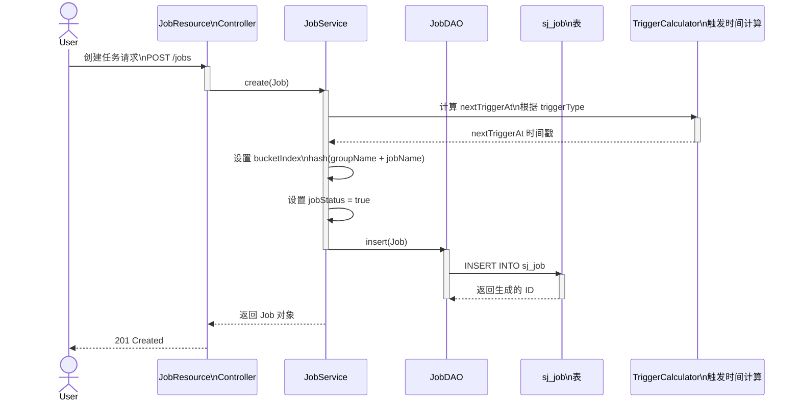
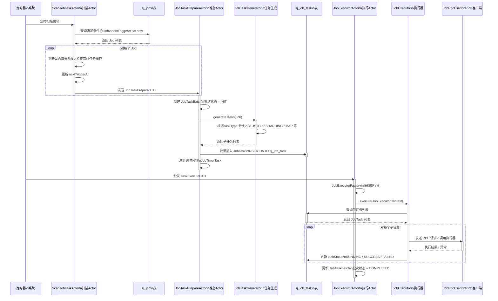
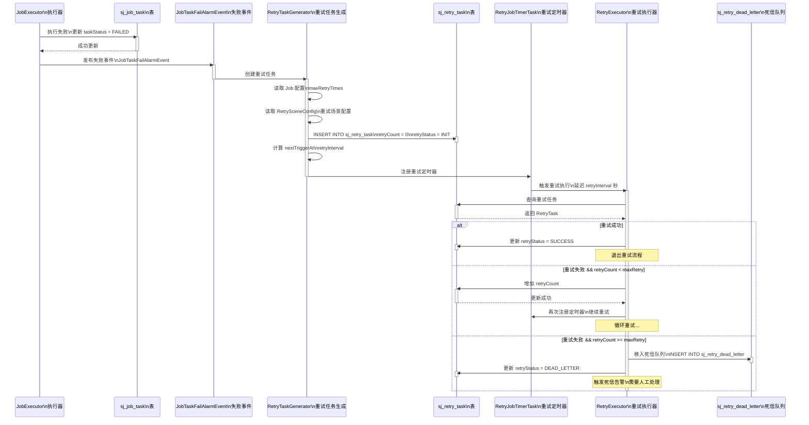
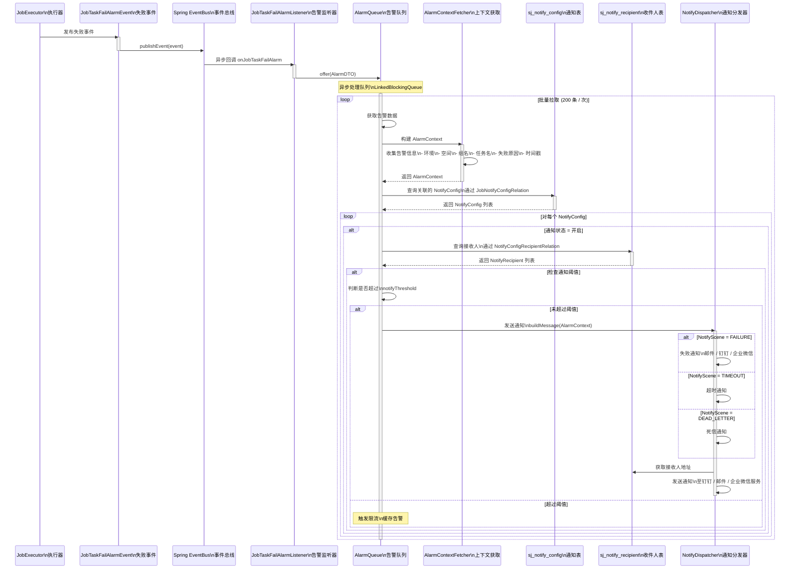
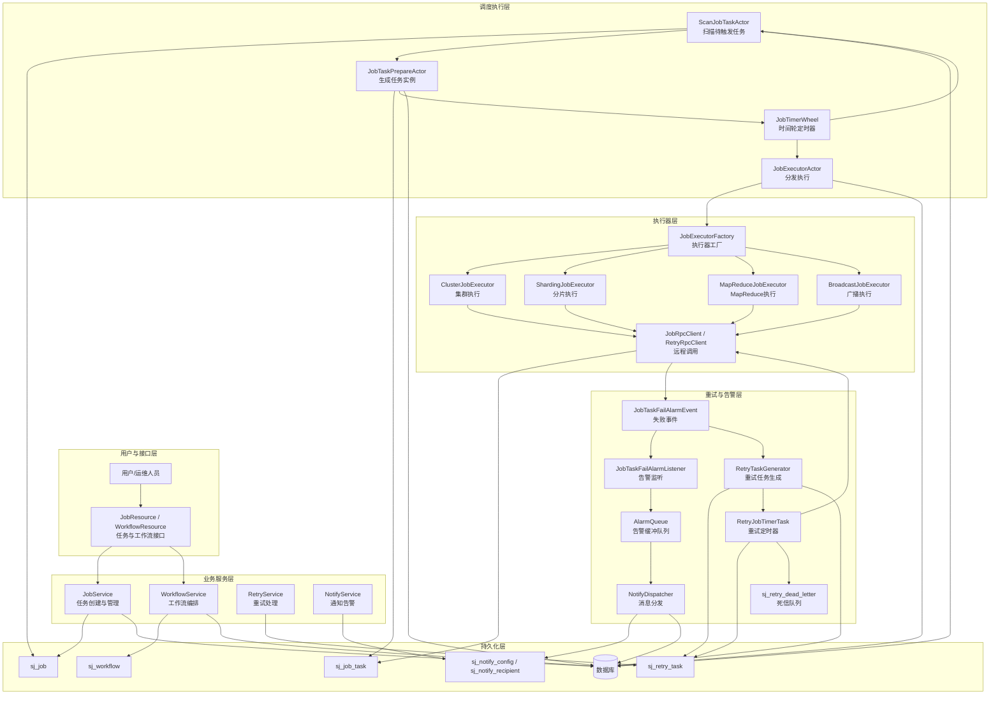
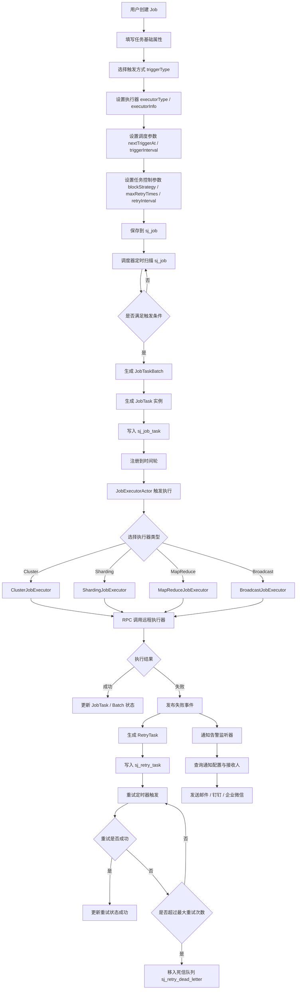

# 任务调度时序图

本文档整理 Silence Job Server 的核心时序图，统一使用 Mermaid 格式，便于在 Markdown 预览中直接查看。

## 1. 任务创建流程

```mermaid
sequenceDiagram
    actor User
    participant Controller as JobResource\nController
    participant Service as JobService
    participant DAO as JobDAO
    participant DB as sj_job\n表
    participant TriggerCalc as TriggerCalculator\n触发时间计算

    User->>Controller: 创建任务请求\nPOST /jobs
    activate Controller
    Controller->>Service: create(Job)
    deactivate Controller

    activate Service
    Service->>TriggerCalc: 计算 nextTriggerAt\n根据 triggerType
    activate TriggerCalc
    TriggerCalc-->>Service: nextTriggerAt 时间戳
    deactivate TriggerCalc

    Service->>Service: 设置 bucketIndex\nhash(groupName + jobName)
    Service->>Service: 设置 jobStatus = true
    Service->>DAO: insert(Job)
    deactivate Service

    activate DAO
    DAO->>DB: INSERT INTO sj_job
    activate DB
    DB-->>DAO: 返回生成的 ID
    deactivate DB
    deactivate DAO

    Service-->>Controller: 返回 Job 对象
    Controller-->>User: 201 Created
```

## 2. 任务调度和执行流程

```mermaid
sequenceDiagram
    participant Timer as 定时器\n系统
    participant ScanActor as ScanJobTaskActor\n扫描Actor
    participant DB as sj_job\n表
    participant PrepareActor as JobTaskPrepareActor\n准备Actor
    participant TaskGen as JobTaskGenerator\n任务生成
    participant TaskDB as sj_job_task\n表
    participant ExecActor as JobExecutorActor\n执行Actor
    participant Executor as JobExecutor\n执行器
    participant RpcClient as JobRpcClient\nRPC客户端

    Timer->>ScanActor: 定时扫描信号
    activate ScanActor

    ScanActor->>DB: 查询满足条件的 Job\nnextTriggerAt <= now
    activate DB
    DB-->>ScanActor: 返回 Job 列表
    deactivate DB

    loop 对每个 Job
        ScanActor->>ScanActor: 判断是否需要触发\n检查常驻任务缓存
        ScanActor->>ScanActor: 更新 nextTriggerAt
        ScanActor->>PrepareActor: 发送 JobTaskPrepareDTO
    end
    deactivate ScanActor

    activate PrepareActor
    PrepareActor->>PrepareActor: 创建 JobTaskBatch\n批次状态 = INIT
    PrepareActor->>TaskGen: generateTasks(Job)

    activate TaskGen
    TaskGen->>TaskGen: 根据 taskType 分支\nCLUSTER / SHARDING / MAP 等
    TaskGen-->>PrepareActor: 返回子任务列表
    deactivate TaskGen

    PrepareActor->>TaskDB: 批量插入 JobTask\nINSERT INTO sj_job_task
    activate TaskDB
    deactivate TaskDB

    PrepareActor->>PrepareActor: 注册到时间轮\nJobTimerTask
    deactivate PrepareActor

    Timer->>ExecActor: 触发 TaskExecuteDTO
    activate ExecActor

    ExecActor->>ExecActor: JobExecutorFactory\n获取执行器
    ExecActor->>Executor: execute(JobExecutorContext)

    activate Executor
    Executor->>TaskDB: 查询子任务列表
    activate TaskDB
    TaskDB-->>Executor: 返回 JobTask 列表
    deactivate TaskDB

    loop 对每个子任务
        Executor->>RpcClient: 发送 RPC 请求\n调用执行器
        activate RpcClient
        RpcClient-->>Executor: 执行结果 / 异常
        deactivate RpcClient

        Executor->>TaskDB: 更新 taskStatus\nRUNNING / SUCCESS / FAILED
    end
    deactivate Executor

    ExecActor->>ExecActor: 更新 JobTaskBatch\n批次状态 = COMPLETED
    deactivate ExecActor
```

## 3. 失败重试和死信处理流程

```mermaid
sequenceDiagram
    participant Executor as JobExecutor\n执行器
    participant TaskDB as sj_job_task\n表
    participant FailEvent as JobTaskFailAlarmEvent\n失败事件
    participant RetryGen as RetryTaskGenerator\n重试任务生成
    participant RetryDB as sj_retry_task\n表
    participant RetryTimer as RetryJobTimerTask\n重试定时器
    participant RetryExec as RetryExecutor\n重试执行器
    participant DeadLetter as sj_retry_dead_letter\n死信队列

    Executor->>TaskDB: 执行失败\n更新 taskStatus = FAILED
    activate TaskDB
    TaskDB-->>Executor: 成功更新
    deactivate TaskDB

    Executor->>FailEvent: 发布失败事件\nJobTaskFailAlarmEvent
    activate FailEvent
    FailEvent->>RetryGen: 创建重试任务
    deactivate FailEvent

    activate RetryGen
    RetryGen->>RetryGen: 读取 Job 配置\nmaxRetryTimes
    RetryGen->>RetryGen: 读取 RetrySceneConfig\n重试场景配置
    RetryGen->>RetryDB: INSERT INTO sj_retry_task\nretryCount = 0\nretryStatus = INIT
    activate RetryDB
    deactivate RetryDB

    RetryGen->>RetryGen: 计算 nextTriggerAt\nretryInterval
    RetryGen->>RetryTimer: 注册重试定时器
    deactivate RetryGen

    RetryTimer->>RetryExec: 触发重试执行\n延迟 retryInterval 秒
    activate RetryExec

    RetryExec->>RetryDB: 查询重试任务
    activate RetryDB
    RetryDB-->>RetryExec: 返回 RetryTask
    deactivate RetryDB

    alt 重试成功
        RetryExec->>RetryDB: 更新 retryStatus = SUCCESS
        activate RetryDB
        deactivate RetryDB
        Note over RetryExec: 退出重试流程
    else 重试失败 && retryCount < maxRetry
        RetryExec->>RetryDB: 增加 retryCount
        activate RetryDB
        RetryDB-->>RetryExec: 更新成功
        deactivate RetryDB

        RetryExec->>RetryTimer: 再次注册定时器\n继续重试
        Note over RetryExec: 循环重试...
    else 重试失败 && retryCount >= maxRetry
        RetryExec->>DeadLetter: 移入死信队列\nINSERT INTO sj_retry_dead_letter
        activate DeadLetter
        deactivate DeadLetter

        RetryExec->>RetryDB: 更新 retryStatus = DEAD_LETTER
        activate RetryDB
        deactivate RetryDB

        Note over RetryExec: 触发死信告警\n需要人工处理
    end
    deactivate RetryExec
```

## 4. 通知告警流程

```mermaid
sequenceDiagram
    participant Executor as JobExecutor\n执行器
    participant FailEvent as JobTaskFailAlarmEvent\n失败事件
    participant EventBus as Spring EventBus\n事件总线
    participant Listener as JobTaskFailAlarmListener\n告警监听器
    participant Queue as AlarmQueue\n告警队列
    participant Fetcher as AlarmContextFetcher\n上下文获取
    participant NotifyDB as sj_notify_config\n通知表
    participant RecipientDB as sj_notify_recipient\n收件人表
    participant Dispatcher as NotifyDispatcher\n通知分发器

    Executor->>FailEvent: 发布失败事件
    activate FailEvent
    FailEvent->>EventBus: publishEvent(event)
    deactivate FailEvent

    EventBus->>Listener: 异步回调 onJobTaskFailAlarm
    activate Listener
    Listener->>Queue: offer(AlarmDTO)
    deactivate Listener

    Note over Queue: 异步处理队列\nLinkedBlockingQueue

    activate Queue
    loop 批量拉取 (200 条 / 次)
        Queue->>Queue: 获取告警数据
        Queue->>Fetcher: 构建 AlarmContext

        activate Fetcher
        Fetcher->>Fetcher: 收集告警信息\n- 环境\n- 空间\n- 组名\n- 任务名\n- 失败原因\n- 时间戳
        Fetcher-->>Queue: 返回 AlarmContext
        deactivate Fetcher

        Queue->>NotifyDB: 查询关联的 NotifyConfig\n通过 JobNotifyConfigRelation
        activate NotifyDB
        NotifyDB-->>Queue: 返回 NotifyConfig 列表
        deactivate NotifyDB

        loop 对每个 NotifyConfig
            alt 通知状态 = 开启
                Queue->>RecipientDB: 查询接收人\n通过 NotifyConfigRecipientRelation
                activate RecipientDB
                RecipientDB-->>Queue: 返回 NotifyRecipient 列表
                deactivate RecipientDB

                alt 检查通知阈值
                    Queue->>Queue: 判断是否超过\nnotifyThreshold

                    alt 未超过阈值
                        Queue->>Dispatcher: 发送通知\nbuildMessage(AlarmContext)
                        activate Dispatcher

                        alt NotifyScene = FAILURE
                            Dispatcher->>Dispatcher: 失败通知\n邮件 / 钉钉 / 企业微信
                        else NotifyScene = TIMEOUT
                            Dispatcher->>Dispatcher: 超时通知
                        else NotifyScene = DEAD_LETTER
                            Dispatcher->>Dispatcher: 死信通知
                        end

                        Dispatcher->>RecipientDB: 获取接收人地址
                        Dispatcher->>Dispatcher: 发送通知\n至钉钉 / 邮件 / 企业微信服务
                        deactivate Dispatcher
                    else 超过阈值
                        Note over Queue: 触发限流\n缓存告警
                    end
                end
            end
        end
    end
    deactivate Queue
```

## 5. 整体流程架构图

```mermaid
graph TB
    subgraph UI["用户与接口层"]
        User["用户/运维人员"]
        API["JobResource / WorkflowResource\n任务与工作流接口"]
    end

    subgraph Service["业务服务层"]
        JobSvc["JobService\n任务创建与管理"]
        WorkflowSvc["WorkflowService\n工作流编排"]
        RetrySvc["RetryService\n重试处理"]
        NotifySvc["NotifyService\n通知告警"]
    end

    subgraph Dispatch["调度执行层"]
        ScanActor["ScanJobTaskActor\n扫描待触发任务"]
        PrepareActor["JobTaskPrepareActor\n生成任务实例"]
        ExecActor["JobExecutorActor\n分发执行"]
        TimerWheel["JobTimerWheel\n时间轮定时器"]
    end

    subgraph Executor["执行器层"]
        Factory["JobExecutorFactory\n执行器工厂"]
        ClusterExec["ClusterJobExecutor\n集群执行"]
        ShardingExec["ShardingJobExecutor\n分片执行"]
        MapReduceExec["MapReduceJobExecutor\nMapReduce执行"]
        BroadcastExec["BroadcastJobExecutor\n广播执行"]
        RpcClient["JobRpcClient / RetryRpcClient\n远程调用"]
    end

    subgraph Retry["重试与告警层"]
        FailEvent["JobTaskFailAlarmEvent\n失败事件"]
        Listener["JobTaskFailAlarmListener\n告警监听"]
        Queue["AlarmQueue\n告警缓冲队列"]
        RetryGen["RetryTaskGenerator\n重试任务生成"]
        RetryTimer["RetryJobTimerTask\n重试定时器"]
        DeadLetter["sj_retry_dead_letter\n死信队列"]
        Dispatcher["NotifyDispatcher\n消息分发"]
    end

    subgraph Persistence["持久化层"]
        DB[("数据库")]
        JobTable["sj_job"]
        JobTaskTable["sj_job_task"]
        WorkflowTable["sj_workflow"]
        RetryTable["sj_retry_task"]
        NotifyTable["sj_notify_config / sj_notify_recipient"]
    end

    User --> API
    API --> JobSvc
    API --> WorkflowSvc

    JobSvc --> JobTable
    WorkflowSvc --> WorkflowTable

    TimerWheel --> ScanActor
    ScanActor --> JobTable
    ScanActor --> PrepareActor
    PrepareActor --> JobTaskTable
    PrepareActor --> TimerWheel

    TimerWheel --> ExecActor
    ExecActor --> Factory
    Factory --> ClusterExec
    Factory --> ShardingExec
    Factory --> MapReduceExec
    Factory --> BroadcastExec
    ClusterExec --> RpcClient
    ShardingExec --> RpcClient
    MapReduceExec --> RpcClient
    BroadcastExec --> RpcClient
    RpcClient --> JobTaskTable

    RpcClient --> FailEvent
    FailEvent --> Listener
    Listener --> Queue
    Queue --> Dispatcher
    Dispatcher --> NotifyTable

    FailEvent --> RetryGen
    RetryGen --> RetryTable
    RetryGen --> RetryTimer
    RetryTimer --> RetryTable
    RetryTimer --> DeadLetter
    RetryTimer --> RpcClient

    RetrySvc --> RetryTable
    NotifySvc --> NotifyTable

    JobSvc --> DB
    WorkflowSvc --> DB
    ScanActor --> DB
    PrepareActor --> DB
    ExecActor --> DB
    RetryGen --> DB
    Dispatcher --> DB
```

## 6. 端到端任务流转图

```mermaid
flowchart TB
    A[用户创建 Job] --> B[填写任务基础属性]
    B --> C[选择触发方式 triggerType]
    C --> D[设置执行器 executorType / executorInfo]
    D --> E[设置调度参数 nextTriggerAt / triggerInterval]
    E --> F[设置任务控制参数 blockStrategy / maxRetryTimes / retryInterval]
    F --> G[保存到 sj_job]
    G --> H[调度器定时扫描 sj_job]
    H --> I{是否满足触发条件}
    I -- 否 --> H
    I -- 是 --> J[生成 JobTaskBatch]
    J --> K[生成 JobTask 实例]
    K --> L[写入 sj_job_task]
    L --> M[注册到时间轮]
    M --> N[JobExecutorActor 触发执行]
    N --> O{选择执行器类型}
    O -- Cluster --> P[ClusterJobExecutor]
    O -- Sharding --> Q[ShardingJobExecutor]
    O -- MapReduce --> R[MapReduceJobExecutor]
    O -- Broadcast --> S[BroadcastJobExecutor]
    P --> T[RPC 调用远程执行器]
    Q --> T
    R --> T
    S --> T
    T --> U{执行结果}
    U -- 成功 --> V[更新 JobTask / Batch 状态]
    U -- 失败 --> W[发布失败事件]
    W --> X[生成 RetryTask]
    X --> Y[写入 sj_retry_task]
    Y --> Z[重试定时器触发]
    Z --> AA{重试是否成功}
    AA -- 是 --> AB[更新重试状态成功]
    AA -- 否 --> AC{是否超过最大重试次数}
    AC -- 否 --> Z
    AC -- 是 --> AD[移入死信队列 sj_retry_dead_letter]
    W --> AE[通知告警监听器]
    AE --> AF[查询通知配置与接收人]
    AF --> AG[发送邮件 / 钉钉 / 企业微信]
```

