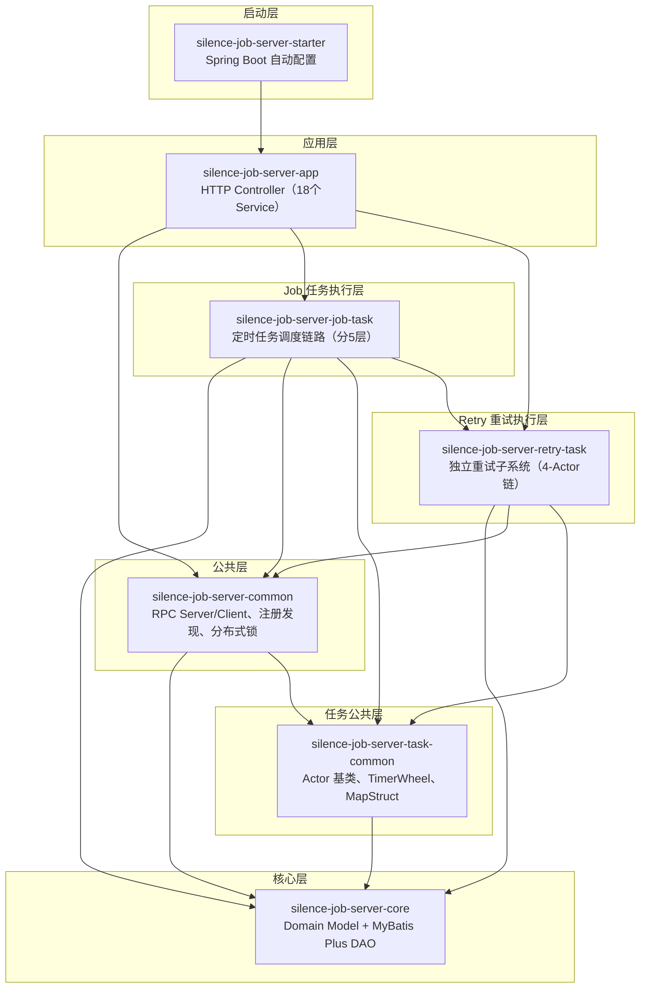

# Silence-Job-Server 项目速查卡

> **一句话概括**：分布式任务调度平台，支持 Cron 定时任务 + DAG 工作流 + 独立重试子系统，底层基于 **Apache Pekko Actor 模型 + 时间轮** 实现调度，**gRPC/Netty HTTP 双通道**进行 RPC 通信。

---

## 一、模块依赖关系图



| 模块 | 代码规模 | 职责 |
|------|---------|------|
| `silence-job-server-starter` | 小 | Spring Boot 启动器，自动装配所有组件 |
| `silence-job-server-app` | **最大** | HTTP Controller 入口，18个Service，包含工作流编辑器和回调处理器 |
| `silence-job-server-common` | **大** | RPC通信（Netty+gRPC）、服务注册发现、负载均衡、分布式锁、告警通知 |
| `silence-job-server-core` | 小 | 数据库实体（MyBatis Plus）、DAO层 |
| `silence-job-server-task-common` | 小 | Actor基类、时间轮（TimerWheel）、MapStruct映射 |
| `silence-job-server-job-task` | **大** | 定时任务的5层Actor调度链路 |
| `silence-job-server-retry-task` | 中 | 独立重试子系统，4-Actor链路 + 时间轮退避 |

---

## 二、技术栈总表

| 类别 | 组件 | 版本 | SNAPSHOT? | 用途 |
|------|------|------|----------|------|
| **运行时** | Java | 21 | - | 运行环境 |
| **框架** | Spring Boot | 父级管理 | ⚠️ | Web、Security、Tx |
| **框架** | Spring Security | 父级管理 | ⚠️ | 权限认证 |
| **Actor模型** | Apache Pekko | 1.0.2 | ❌ | 调度链路（Job/Workflow/Retry共用） |
| **Scala** | scala-library | 2.13.12 | ❌ | Pekko 依赖 |
| **RPC - gRPC** | grpc-netty-shaded | 1.58.0 | ❌ | 高性能 RPC 调用 |
| **RPC - gRPC** | grpc-protobuf / stub / api | 1.58.0 | ❌ | gRPC 接口定义 |
| **序列化** | protobuf-java / javalite | 3.25.1 | ❌ | gRPC 序列化 |
| **网络** | netty-all / codec-http | 父级管理 | ⚠️ | Netty HTTP 通道 |
| **数据库** | mysql-connector-j | 父级管理 | ⚠️ | MySQL 连接 |
| **ORM** | MyBatis Plus | 2.0.1-SNAPSHOT | ⚠️ 内部包 | DAO 层 |
| **缓存** | Caffeine | 父级管理 | ⚠️ | 本地缓存 |
| **服务发现** | Nacos Client | 父级管理 | ⚠️ | 注册中心 |
| **配置中心** | platform-cloud-config | 2.0.1-SNAPSHOT | ⚠️ 内部包 | 配置读取 |
| **工具** | Guava | 32.1.2-jre | ❌ | 缓存、限流、工具类 |
| **重试** | guava-retrying | 2.0.0 | ❌ | RPC 客户端重试 |
| **表达式** | Aviator | 5.3.3 | ❌ | 工作流条件判断表达式 |
| **表达式** | QLExpress | 3.3.1 | ❌ | 工作流条件判断表达式 |
| **映射** | MapStruct + spring-annotations | 父级管理 | ⚠️ | DTO/Entity 转换 |
| **监控** | Perf4j | 0.9.16 | ❌ | 性能日志 |
| **持久化API** | Jakarta Persistence API | 3.1.0 | ❌ | JPA 注解 |
| **项目自身** | silence-job-server | **3.0.0-SNAPSHOT** | ⚠️ | 本项目版本 |

> ⚠️ = SNAPSHOT / 内部包，需要关注稳定性  
> ❌ = 稳定版本

---

## 三、核心类速查表

### 3.1 调度层（Dispatch Layer）

| 类名 | 作用 | 文件路径 |
|------|------|---------|
| `DispatchService` | 定时扫描任务（每100ms），按 Bucket 分发 | `app/.../service/DispatchService.java` |
| `ConsumerBucketActor` | 按 Bucket 路由到对应扫描 Actor | `task-common/.../actor/ConsumerBucketActor.java` |
| `ScanJobTaskActor` | 扫描待执行的 Job 任务 | `job-task/.../dispatch/ScanJobTaskActor.java` |
| `ScanWorkflowTaskActor` | 扫描待执行的 Workflow | `job-task/.../dispatch/ScanWorkflowTaskActor.java` |
| `ScanRetryActor` | 扫描重试任务（500ms 时间轮） | `retry-task/.../dispatch/ScanRetryActor.java` |

### 3.2 预处理层（Prepare Layer）

| 类名 | 作用 | 文件路径 |
|------|------|---------|
| `JobTaskPrepareActor` | Job 任务预处理，检查阻塞策略 | `job-task/.../prepare/JobTaskPrepareActor.java` |
| `WorkflowTaskPrepareActor` | Workflow 预处理，构建 DAG 图 | `job-task/.../prepare/WorkflowTaskPrepareActor.java` |
| `RetryTaskPrepareActor` | Retry 预处理，分流到 WAITING/RUNNING/TERMINAL | `retry-task/.../prepare/RetryTaskPrepareActor.java` |

### 3.3 执行层（Executor Layer）

| 类名 | 作用 | 文件路径 |
|------|------|---------|
| `JobExecutorActor` | Job 执行入口，处理阻塞策略 | `job-task/.../executor/JobExecutorActor.java` |
| `WorkflowExecutorActor` | Workflow 执行入口，按 DAG 调度节点 | `job-task/.../executor/WorkflowExecutorActor.java` |
| `RealJobExecutorActor` | **真正执行**：选择节点 + RPC 发送到客户端 | `task-common/.../executor/RealJobExecutorActor.java` |
| `RetryExecutorActor` | 重试执行：走时间轮触发 + RPC 发送 | `retry-task/.../executor/RetryExecutorActor.java` |

### 3.4 结果处理层

| 类名 | 作用 | 文件路径 |
|------|------|---------|
| `JobResultActor` | 处理 Job 执行成功/失败结果 | `job-task/.../result/JobResultActor.java` |
| `WorkflowResultActor` | 处理 Workflow 节点完成/失败结果 | `job-task/.../result/WorkflowResultActor.java` |
| `RetryResultActor` | Retry 结果分发：成功/失败/死信 | `retry-task/.../result/RetryResultActor.java` |
| `ClientCallbackHandler` | **HTTP 回调入口**：客户端回调处理 | `app/.../handler/ClientCallbackHandler.java` |

### 3.5 分布式基础设施

| 类名 | 作用 | 文件路径 |
|------|------|---------|
| `ServerRegister` | 服务端心跳注册（20s续约） | `common/.../register/ServerRegister.java` |
| `ClientRegister` | 客户端心跳注册（LinkedBlockingDeque队列） | `common/.../register/ClientRegister.java` |
| `CacheRegisterTable` | 本地缓存注册表（Guava Cache 60s过期） | `common/.../register/CacheRegisterTable.java` |
| `ClientNodeAllocateHandler` | 节点分配（委托给负载均衡器） | `common/.../allocate/ClientNodeAllocateHandler.java` |
| `ClientLoadBalanceManager` | 负载均衡策略管理（7种策略） | `common/.../allocate/ClientLoadBalanceManager.java` |
| `JdbcLockProvider` | JDBC 分布式锁存储 | `common/.../lock/persistence/JdbcLockProvider.java` |
| `ResidentLockProvider` | 常驻锁（定时任务用） | `common/.../lock/ResidentLockProvider.java` |
| `DisposableLockProvider` | 一次性锁（扫描任务用） | `common/.../lock/DisposableLockProvider.java` |

### 3.6 RPC 通信层

| 类名 | 作用 | 文件路径 |
|------|------|---------|
| `NettyHttpServer` | Netty HTTP 服务器（NioEventLoopGroup） | `common/.../netty/server/NettyHttpServer.java` |
| `GrpcServer` | gRPC 服务器（NettyServerBuilder） | `common/.../grpc/server/GrpcServer.java` |
| `NettyHttpConnectClient` | Netty HTTP 客户端（IdleStateHandler 30s） | `common/.../netty/client/NettyHttpConnectClient.java` |
| `RequestBuilder` | **动态代理构建器**：选择 Netty/gRPC | `common/.../rpc/RequestBuilder.java` |
| `RpcClientInvokeHandler` | Netty RPC 调用处理器（Guava Retryer） | `common/.../rpc/client/RpcClientInvokeHandler.java` |
| `GrpcClientInvokeHandler` | gRPC 调用处理器 | `common/.../grpc/client/GrpcClientInvokeHandler.java` |
| `BeatHttpRequestHandler` | 心跳检测 Handler（`/api/beat`） | `common/.../netty/server/handler/BeatHttpRequestHandler.java` |
| `ConfigHttpRequestHandler` | 配置同步 Handler（`/api/sync/config`） | `common/.../netty/server/handler/ConfigHttpRequestHandler.java` |
| `ReportLogHttpRequestHandler` | 日志上报 Handler（`/api/log/report`） | `common/.../netty/server/handler/ReportLogHttpRequestHandler.java` |

### 3.7 时间轮（Timer Wheel）

| 类名 | 作用 | 文件路径 |
|------|------|---------|
| `RetryTimerWheel` | Retry 超时检测（500ms tick, 512 slots, 16线程） | `retry-task/.../timer/RetryTimerWheel.java` |
| `JobTimerWheel` | Job 超时检测（1s tick, 512 slots） | `task-common/.../timer/JobTimerWheel.java` |

### 3.8 告警通知

| 类名 | 作用 | 文件路径 |
|------|------|---------|
| `AlarmNotifyChainFactory` | 告警通知链工厂 | `common/.../alarm/AlarmNotifyChainFactory.java` |
| `AlarmNotifyChain` | 告警通知责任链（支持多种通道） | `common/.../alarm/AlarmNotifyChain.java` |
| `AlarmNotifyHandler` | 抽象告警处理器（模板方法） | `common/.../alarm/handler/AlarmNotifyHandler.java` |

---

## 四、子系统一句话理解

### 1. 任务调度子系统（Job/Workflow）
> **通过 Pekko Actor 的 5 层链路（扫描→预处理→阻塞策略→执行→结果处理），将定时任务从数据库取出并分发给客户端节点。**

关键链路：`ScanJobTaskActor` → `JobTaskPrepareActor` → `JobExecutorActor` → `RealJobExecutorActor` → `Client`

### 2. 重试子系统（Retry）
> **独立的 4-Actor 链路 + 时间轮退避，专门处理失败任务的重试，支持 BLOCK/CONCURRENT/DISCARD 等阻塞策略。**

关键链路：`ScanRetryActor` → `RetryTaskPrepareActor` → 时间轮 → `RetryExecutorActor` → `RetryResultActor`

### 3. 服务注册发现子系统
> **服务端/客户端通过心跳维持注册，心跳数据存 MySQL + 本地 Guava Cache 双写，CacheLockRecord 解决跨 POD 一致性问题。**

关键链路：心跳队列（`LinkedBlockingDeque`）→ 多线程拉取 → `CacheRegisterTable` → `CacheLockRecord`

### 4. 负载均衡子系统
> **7 种路由策略（一致性哈希/Random/LRU/Round/First/Last/权重），通过 `ClientLoadBalanceManager` 策略注册表统一分发。**

### 5. 分布式锁子系统
> **JDBC 表存储 + 版本号乐观锁，`ResidentLockProvider` 用于定时任务常驻锁，`DisposableLockProvider` 用于扫描任务一次性锁。**

### 6. RPC 通信子系统
> **双通道架构：Netty HTTP 处理控制面（心跳/配置/日志），gRPC 处理数据面（任务执行），客户端通过 `RequestBuilder` 动态选择通道。**

### 7. 告警通知子系统
> **责任链模式，AlarmNotifyHandler 模板方法，支持多种通知通道，可插拔扩展。**

### 8. 工作流子系统（Workflow）
> **DAG 工作流，支持 JOB_TASK / DECISION / CALLBACK 三种节点类型，通过 Guava `MutableGraph` 构建有向无环图，节点按拓扑顺序执行。**

---

## 五、数据库表速查

| 表名 | 用途 |
|------|------|
| `server_register` | 服务端节点注册信息 |
| `client_register` | 客户端节点注册信息 |
| `job_task_batch` | Job 任务批次（一次调度） |
| `job_task` | Job 任务执行实例 |
| `workflow_task_batch` | Workflow 批次 |
| `workflow_node` | Workflow 节点定义 |
| `retry_task` | 重试任务 |
| `retry_task_batch` | 重试批次 |
| `retry_dead_letter` | 死信队列 |
| `alarm_notify_record` | 告警通知记录 |
| `alarm_rule` | 告警规则 |
| `distributed_lock` | 分布式锁记录 |

---

## 六、关键配置参数速查

| 配置项 | 默认值 | 含义 |
|--------|--------|------|
| `dispatch.scan.interval` | 100ms | 调度扫描间隔 |
| `job.retry.max` | - | Job 最大重试次数 |
| `job.timeout` | - | Job 执行超时时间 |
| `client.heartbeat.interval` | 20s | 客户端心跳间隔 |
| `server.heartbeat.renew.interval` | 20s | 服务端心跳续约间隔 |
| `cache.register.expire` | 60s | 本地缓存过期时间 |
| `timerwheel.retry.tick` | 500ms | 重试时间轮 tick |
| `timerwheel.retry.slots` | 512 | 重试时间轮槽数 |
| `timerwheel.job.tick` | 1s | Job 时间轮 tick |
| `netty.idle.state` | 30s | Netty 空闲检测 |
| `netty.connect.timeout` | 10s | 连接超时 |
| `rate.limiter.try-acquire` | 500ms | 限流器获取超时 |
| `idempotent.key.expire` | 20s | 幂等 key 过期时间 |

---

## 七、项目结构一览

```
silence-job-server/
├── pom.xml                          # 父 POM（版本 3.0.0-SNAPSHOT）
│
├── silence-job-server-starter/      # Spring Boot 启动器
│   └── SilenceJobCenterApplication  # Main Class
│
├── silence-job-server-app/          # 应用层（最大，18 Service）
│   ├── controller/                  # HTTP Controller
│   ├── handler/                     # 回调处理器
│   ├── service/                     # 业务 Service
│   └── service/impl/                # 实现
│
├── silence-job-server-common/       # 公共组件
│   ├── register/                    # 服务注册发现
│   ├── lock/                        # 分布式锁
│   ├── netty/                       # Netty HTTP Server/Client
│   ├── grpc/                        # gRPC Server/Client
│   ├── alarm/                       # 告警通知链
│   └── loadbalance/                 # 负载均衡
│
├── silence-job-server-core/         # 核心层（DAO + Entity）
│   ├── domain/model/                # 数据库实体
│   └── dao/                         # MyBatis Plus Mapper
│
├── silence-job-server-task-common/  # 任务公共层
│   ├── executor/                    # 执行器基类
│   ├── timer/                       # 时间轮
│   └── rpc/                         # RPC 请求构建
│
├── silence-job-server-job-task/     # Job 任务执行
│   ├── dispatch/                    # 调度 Actor
│   ├── prepare/                     # 预处理 Actor
│   ├── executor/                    # 执行器
│   ├── result/                      # 结果处理
│   └── workflow/                    # 工作流执行
│
├── silence-job-server-retry-task/  # 重试任务执行
│   ├── dispatch/                    # 重试扫描
│   ├── prepare/                     # 重试预处理
│   ├── executor/                    # 重试执行
│   └── result/                      # 结果/死信处理
│
└── doc/                             # 文档目录
    ├── 02-execution-chain-analysis.md
    ├── 05-retry-subsystem-analysis.md
    ├── 06-distributed-infrastructure-analysis.md
    ├── 07-rpc-communication-analysis.md
    └── 00-PROJECT-CHEAT-SHEET.md ← 你在这里
```

---

> 📌 本文档为速查手册，详细信息请参考 `doc/02-07` 系列分析文档。
