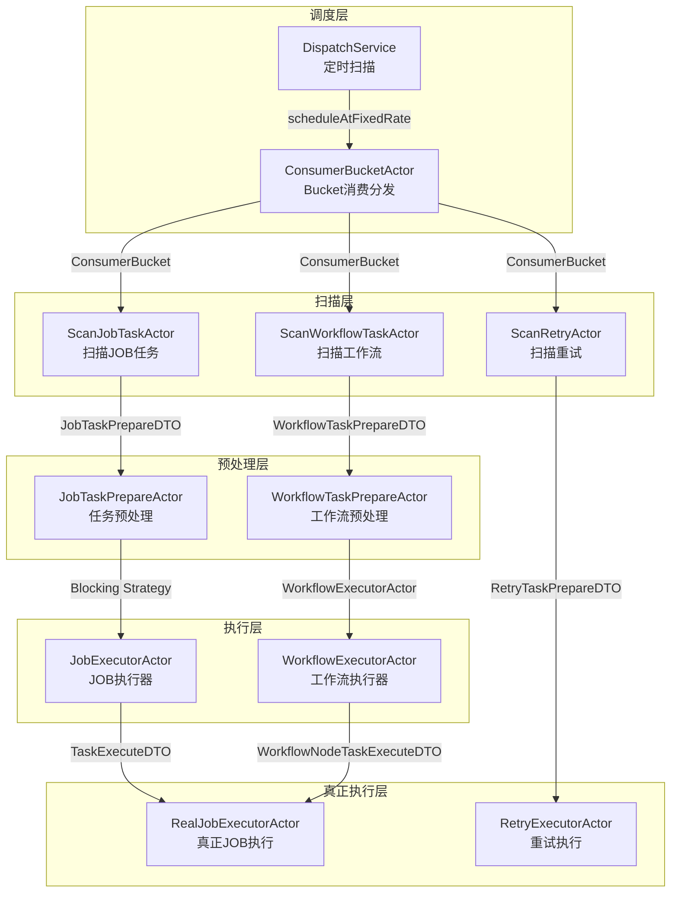
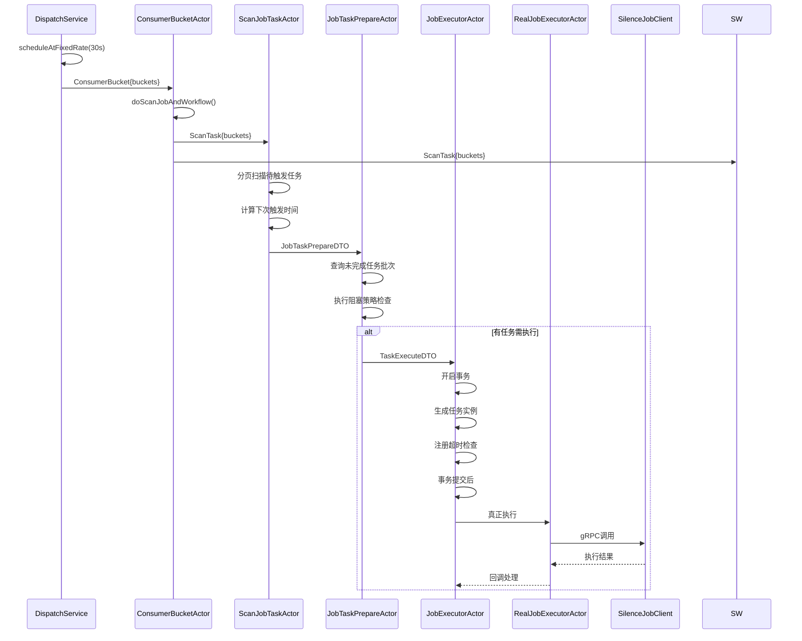
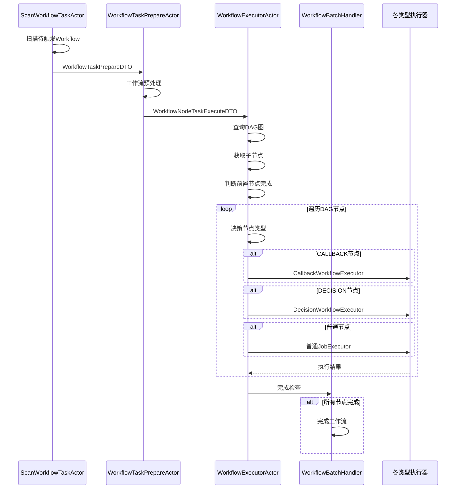
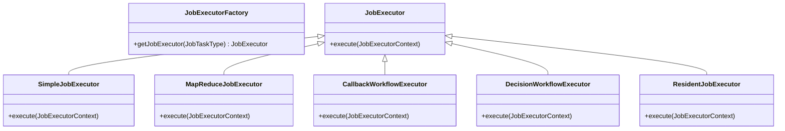
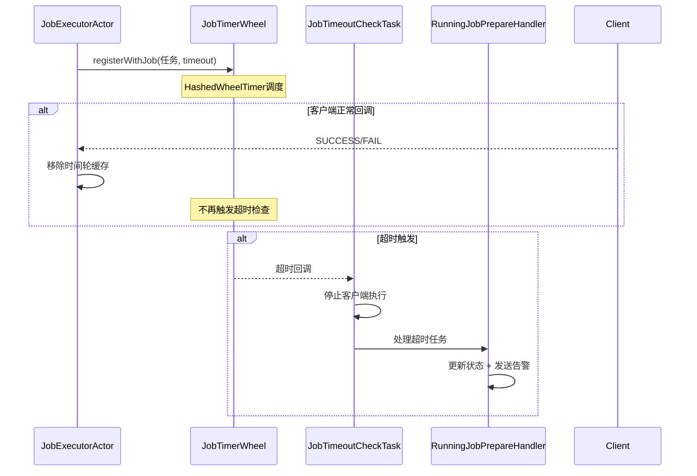

# 任务执行链路源码走读

> 本文档详细分析 Silence-Job-Server 的任务执行链路，从调度触发到任务完成的完整流程。

---

## 一、整体架构图



---

## 二、Actor 系统架构

### 2.1 三大 ActorSystem

| ActorSystem | 用途 | dispatcher配置 |
|-------------|------|----------------|
| `commonActorSystem` | 扫描、日志 | `pekko.actor.common-scan-task-dispatcher` |
| `jobActorSystem` | 任务执行、调度 | `pekko.actor.job-task-prepare-dispatcher` |
| `retryActorSystem` | 重试任务执行 | `pekko.actor.retry-task-executor-dispatcher` |
| `nettyActorSystem` | 客户端请求处理 | `pekko.actor.netty-receive-request-dispatcher` |

### 2.2 完整 Actor 清单

#### 通用层 (commonActorSystem)
| Actor名称 | 类名 | 职责 |
|-----------|------|------|
| `ScanBucketActor` | `ConsumerBucketActor` | 消费Bucket，生成扫描任务 |
| `ScanJobActor` | `ScanJobTaskActor` | 扫描待触发的JOB任务 |
| `ScanWorkflowTaskActor` | `ScanWorkflowTaskActor` | 扫描待触发的Workflow任务 |
| `ScanRetryActor` | `ScanRetryActor` | 扫描待重试任务 |
| `RetryLogActor` | `RetryLogActor` | 重试任务日志记录 |
| `JobLogActor` | `JobLogActor` | JOB任务日志记录 |
| `RequestHandlerActor` | `RequestHandlerActor` | Netty请求处理 |
| `GrpcRequestHandlerActor` | `GrpcRequestHandlerActor` | gRPC请求处理 |

#### 任务调度层 (jobActorSystem)
| Actor名称 | 类名 | 职责 |
|-----------|------|------|
| `JobTaskPrepareActor` | `JobTaskPrepareActor` | JOB任务预处理（阻塞策略） |
| `WorkflowTaskPrepareActor` | `WorkflowTaskPrepareActor` | Workflow预处理 |
| `JobExecutorActor` | `JobExecutorActor` | JOB任务执行入口 |
| `WorkflowExecutorActor` | `WorkflowExecutorActor` | Workflow执行入口 |
| `JobExecutorResultActor` | `JobExecutorResultActor` | 任务执行结果处理 |
| `JobReduceActor` | - | 动态分片Reduce |
| `RealJobExecutorActor` | `RealJobExecutorActor` | 真正向客户端发起请求 |
| `JobRealStopTaskInstanceActor` | - | 停止任务实例 |

#### 重试任务层 (retryActorSystem)
| Actor名称 | 类名 | 职责 |
|-----------|------|------|
| `RetryTaskPrepareActor` | `RetryTaskPrepareActor` | 重试任务预处理 |
| `RetryExecutorActor` | `RetryExecutorActor` | 重试任务执行入口 |
| `RetryExecutorResultActor` | `RetryResultActor` | 重试结果处理 |
| `RealRetryExecutorActor` | `RequestRetryClientActor` | 真正调用客户端重试 |
| `RealCallbackExecutorActor` | `RequestCallbackClientActor` | 回调执行 |
| `RetryRealStopTaskInstanceActor` | `RequestStopClientActor` | 停止重试任务 |

---

## 三、核心执行链路详解

### 3.1 定时任务执行链路



### 3.2 工作流执行链路



---

## 四、关键源码解析

### 4.1 DispatchService - 调度入口

**文件**: `silence-job-server-starter/src/main/java/com/old/silence/job/server/dispatch/DispatchService.java`

```java
@Override
public void start() {
    ActorRef actorRef = ActorGenerator.scanBucketActor();
    dispatchService.scheduleAtFixedRate(() -> {
        // 1. 检查是否正在rebalance
        if (DistributeInstance.RE_BALANCE_ING.get()) {
            TimeUnit.SECONDS.sleep(INITIAL_DELAY);
        }
        // 2. 获取当前节点负责的Bucket
        Set<Integer> currentConsumerBuckets = getConsumerBucket();
        // 3. 发送扫描任务
        ConsumerBucket scanTaskDTO = new ConsumerBucket();
        scanTaskDTO.setBuckets(currentConsumerBuckets);
        actorRef.tell(scanTaskDTO, actorRef);
    }, INITIAL_DELAY, PERIOD, TimeUnit.SECONDS);
}
```

**关键点**:
- 定时周期: 30秒 (`PERIOD = SystemConstants.SCHEDULE_PERIOD`)
- 启动延迟: 30秒 (`INITIAL_DELAY`)
- rebalance等待: 如正在rebalance则延迟30秒

---

### 4.2 ConsumerBucketActor - Bucket消费分发

**文件**: `silence-job-server-starter/src/main/java/com/old/silence/job/server/dispatch/ConsumerBucketActor.java`

```java
private void doDispatch(ConsumerBucket consumerBucket) {
    // 1. 扫描 JOB && WORKFLOW
    doScanJobAndWorkflow(consumerBucket);
    // 2. 扫描重试任务
    doScanRetry(consumerBucket);
}

private void doScanRetry(final ConsumerBucket consumerBucket) {
    // 根据并行度计算分区
    int retryMaxPullParallel = systemProperties.getRetryMaxPullParallel();
    List<List<Integer>> partitions = Lists.partition(...);
    for (List<Integer> buckets : partitions) {
        ScanTask scanTask = new ScanTask();
        scanTask.setBuckets(new HashSet<>(buckets));
        ActorGenerator.scanRetryActor().tell(scanTask);
    }
}
```

**关键点**:
- 使用 `CacheGroupScanActor` 缓存ActorRef，避免重复创建
- 重试任务支持并行拉取配置

---

### 4.3 ScanJobTaskActor - 任务扫描

**文件**: `silence-job-server-job-task/src/main/java/com/old/silence/job/server/job/task/support/dispatch/ScanJobTaskActor.java`

```java
private void doScan(final ScanTask scanTask) {
    // 分批处理，避免内存溢出
    PartitionTaskUtils.process(startId -> listAvailableJobs(startId, scanTask),
            this::processJobPartitionTasks, 0);
}

private List<JobPartitionTaskDTO> listAvailableJobs(Long startId, ScanTask scanTask) {
    // 查询条件:
    // 1. 状态开启 (jobStatus = true)
    // 2. 非工作流触发 (ne triggerType)
    // 3. 在当前Bucket内 (in bucketIndex)
    // 4. 待触发时间 <= now + 30s
    return jobDao.selectPage(page,
        new LambdaQueryWrapper<Job>()
            .eq(Job::getJobStatus, true)
            .ne(Job::getTriggerType, WORKFLOW_TRIGGER_TYPE)
            .in(Job::getBucketIndex, scanTask.getBuckets())
            .le(Job::getNextTriggerAt, now + SCHEDULE_PERIOD)
    );
}

private void processJobPartitionTasks(List<PartitionTask> partitionTasks) {
    for (PartitionTask partitionTask : partitionTasks) {
        // 计算下次触发时间
        Long nextTriggerAt = calculateNextTriggerTime(partitionTask, now);
        // 发送给预处理Actor
        ActorGenerator.jobTaskPrepareActor().tell(waitExecJob);
    }
}
```

**关键点**:
- 分页处理，避免一次性加载大量数据
- 只查询 `now + 30s` 内的待触发任务
- 常驻任务使用内存缓存

---

### 4.4 JobExecutorActor - 任务执行核心

**文件**: `silence-job-server-job-task/src/main/java/com/old/silence/job/server/job/task/support/dispatch/JobExecutorActor.java`

```java
private void doExecute(final TaskExecuteDTO taskExecute) {
    Job job = jobDao.selectById(taskExecute.getJobId());

    // 1. 校验任务状态
    if (Objects.isNull(job) || !job.getJobStatus()) {
        // 任务关闭
        handleTaskBatch(taskExecute, CANCEL, JOB_CLOSED);
        return;
    }

    // 2. 检查客户端节点
    if (CollectionUtils.isEmpty(getServerNodeSet(job.getGroupName()))) {
        // 无客户端节点
        publishEvent(JOB_NO_CLIENT_NODES_ERROR);
        return;
    }

    // 3. 开启事务
    handleTaskBatch(taskExecute, RUNNING, NONE);

    // 4. 生成任务实例
    JobTaskGenerator taskInstance = JobTaskGeneratorFactory.getTaskInstance(job.getTaskType());
    List<JobTask> taskList = taskInstance.generate(context);

    // 5. 事务提交后执行
    TransactionSynchronizationManager.registerSynchronization(new TransactionSynchronization() {
        @Override
        public void afterCommit() {
            // 6. 获取执行器并执行
            JobExecutor jobExecutor = JobExecutorFactory.getJobExecutor(job.getTaskType());
            jobExecutor.execute(buildJobExecutorContext());
        }
    });

    // 7. 注册超时检查
    JobTimerWheel.registerWithJob(
        () -> new JobTimeoutCheckTask(taskBatchId, jobId),
        Duration.ofMillis(executorTimeout + 500)
    );
}
```

**关键点**:
- 事务内完成状态更新，事务后异步执行
- 注册超时检查到时间轮
- 失败发送告警事件

---

## 五、执行器工厂

### 5.1 JobExecutorFactory - JOB执行器选择



### 5.2 5种任务类型执行器

| 执行器 | 任务类型 | 说明 |
|--------|----------|------|
| `SimpleJobExecutor` | SIMPLE | 简单任务，一次性执行 |
| `MapReduceJobExecutor` | MAP/MAP_REDUCE | 分片任务，支持Map/Reduce两阶段 |
| `CallbackWorkflowExecutor` | WORKFLOW(CALLBACK) | 回调型工作流 |
| `DecisionWorkflowExecutor` | WORKFLOW(DECISION) | 决策型工作流 |
| `ResidentJobExecutor` | RESIDENT | 常驻任务 |

---

## 六、阻塞策略处理

### 6.1 策略模式实现

```java
// WaitStrategies.java
public enum WaitStrategyEnum {
    DISCARD(1, new DiscardWaitStrategy()),      // 丢弃策略
    COVER_EARLY(2, new CoverEarlyWaitStrategy()), // 覆盖策略
    COVER_LATER(3, new CoverLaterWaitStrategy()), // 后续覆盖
    PARALLEL(4, new ParallelWaitStrategy());     // 并行策略

    private final int value;
    private final WaitStrategy strategy;

    public WaitStrategy getWaitStrategy() {
        return strategy;
    }
}
```

### 6.2 阻塞策略说明

| 策略 | 枚举值 | 行为 |
|------|--------|------|
| **丢弃策略** | DISCARD | 新任务到达时直接丢弃 |
| **覆盖策略** | COVER_EARLY | 中断当前任务，立即执行新任务 |
| **后续覆盖** | COVER_LATER | 当前任务完成后执行新任务 |
| **并行策略** | PARALLEL | 多个任务并行执行 |

---

## 七、时间轮超时机制

### 7.1 HashedWheelTimer 使用

```java
// JobTimerWheel.java
public class JobTimerWheel {
    private static final HashedWheelTimer TIMER = new HashedWheelTimer(
        new NamedThreadFactory("job-timer-wheel"),
        100, TimeUnit.MILLISECONDS, 512
    );

    public static void registerWithJob(Runnable task, Duration timeout) {
        TIMER.newTimeout(task, timeout.toMillis(), TimeUnit.MILLISECONDS);
    }
}
```

### 7.2 超时检查流程



---

## 八、常驻任务优化

### 8.1 设计背景

常驻任务（如心跳检测）需要持续执行，不适用传统定时调度。

### 8.2 优化方案

```java
// ResidentTaskCache.java
public class ResidentTaskCache {
    private static final Map<Long/*jobId*/, Long/*nextTriggerAt*/> CACHE = new ConcurrentHashMap<>();

    public static void put(Long jobId, Long nextTriggerAt) {
        CACHE.put(jobId, nextTriggerAt);
    }

    public static Long get(Long jobId) {
        return CACHE.get(jobId);
    }

    public static void remove(Long jobId) {
        CACHE.remove(jobId);
    }
}
```

### 8.3 执行流程

```java
private void processJob(JobPartitionTaskDTO partitionTask, ...) {
    Long cachedTriggerAt = ResidentTaskCache.get(partitionTask.getId());

    if (!partitionTask.getResident()) {
        // 非常驻任务：计算下次触发时间
        nextTriggerAt = calculateNextTriggerTime(partitionTask, now);
    } else {
        // 常驻任务：使用缓存
        if (Objects.isNull(cachedTriggerAt)) {
            triggerTask = true;  // 首次触发
            nextTriggerAt = now;
        } else {
            triggerTask = false; // 已触发，等待回调
        }
    }

    // 回调后开启下一次
    jobTaskBatchHandler.openResidentTask(job, taskExecute);
}
```

---

## 九、设计模式总结

| 模式 | 应用场景 |
|------|----------|
| **Actor并发模型** | Pekko处理高并发任务分发 |
| **策略模式** | WaitStrategy阻塞策略、JobExecutor执行器选择 |
| **模板方法** | AbstractLogActor日志记录骨架 |
| **责任链模式** | JobPrepareHandler预处理链 |
| **工厂模式** | JobExecutorFactory、JobTaskGeneratorFactory |
| **观察者模式** | ApplicationEvent事件驱动告警 |
| **装饰器模式** | JobTimeoutCheckTask超时包装 |
| **门面模式** | ActorGenerator统一入口 |

---

## 十、关键文件索引

| 文件 | 路径 |
|------|------|
| DispatchService | `starter/.../dispatch/DispatchService.java` |
| ConsumerBucketActor | `starter/.../dispatch/ConsumerBucketActor.java` |
| ScanJobTaskActor | `job-task/.../dispatch/ScanJobTaskActor.java` |
| JobTaskPrepareActor | `job-task/.../dispatch/JobTaskPrepareActor.java` |
| JobExecutorActor | `job-task/.../dispatch/JobExecutorActor.java` |
| WorkflowExecutorActor | `job-task/.../dispatch/WorkflowExecutorActor.java` |
| ActorGenerator | `common/.../pekko/ActorGenerator.java` |
| JobTimerWheel | `job-task/.../timer/JobTimerWheel.java` |
| WaitStrategies | `common/.../strategy/WaitStrategies.java` |
