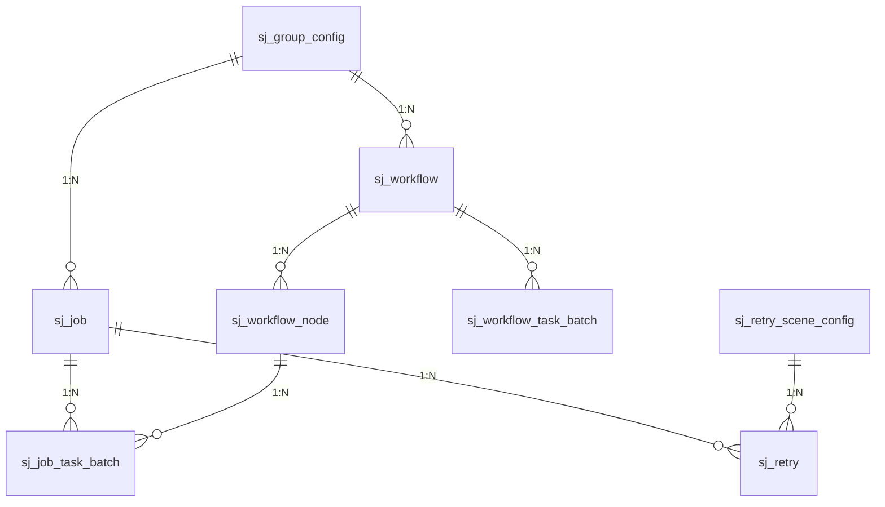
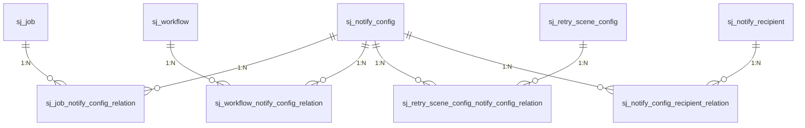

# 数据库表结构与领域模型对应关系分析

> 本文档详细分析 Silence-Job-Server 的数据库表结构与 Java 领域模型的映射关系。

---

## 一、概览

| 指标 | 值 |
|------|------|
| 表名前缀 | `sj_` (Silence Job) |
| 实体类总数 | 28 个 |
| DAO 接口数 | 25 个 |
| 关联表数 | 4 个多对多关系表 |
| 映射框架 | MyBatis-Plus 注解自动映射 |
| 逻辑删除 | `@TableLogic` + `is_deleted` 字段 |
| ID生成策略 | `AbstractAutoGeneratedIdAuditableTenantable` |

### 1.1 基础表 vs 关联表



---

## 二、核心业务表

### 2.1 sj_job - 定时任务配置表

**实体类**: `com.old.silence.job.server.domain.model.Job`
**文件路径**: `silence-job-server-core/src/main/java/com/old/silence/job/server/domain/model/Job.java`

| 字段名 | Java属性 | 类型 | 说明 |
|--------|----------|------|------|
| `id` | `id` | BIGINT | 主键，自增 |
| `group_name` | `groupName` | String | 组名称 |
| `job_name` | `jobName` | String | 任务名称 |
| `args_str` | `argsStr` | String | 执行参数 |
| `args_type` | `argsType` | Enum | 参数类型(text/json) |
| `ext_attrs` | `extAttrs` | String | 扩展字段(JSON) |
| `next_trigger_at` | `nextTriggerAt` | Long | 下次触发时间(毫秒) |
| `job_status` | `jobStatus` | Boolean | 任务状态(0关闭/1开启) |
| `route_key` | `routeKey` | Integer | 执行器路由策略 |
| `executor_type` | `executorType` | Enum | 执行器类型(Java/Python/Go) |
| `executor_info` | `executorInfo` | String | 执行器信息 |
| `trigger_type` | `triggerType` | Enum | 触发类型(CRON/固定时间) |
| `trigger_interval` | `triggerInterval` | String | 间隔时长 |
| `block_strategy` | `blockStrategy` | Enum | 阻塞策略 |
| `executor_timeout` | `executorTimeout` | Integer | 执行超时(秒) |
| `max_retry_times` | `maxRetryTimes` | Integer | 最大重试次数 |
| `retry_interval` | `retryInterval` | Integer | 重试间隔(秒) |
| `task_type` | `taskType` | Enum | 任务类型 |
| `parallel_num` | `parallelNum` | Integer | 并行数 |
| `bucket_index` | `bucketIndex` | Integer | Bucket索引(0-127) |
| `resident` | `resident` | Boolean | 是否常驻任务 |
| `description` | `description` | String | 描述 |
| `owner_id` | `ownerId` | BIGINT | 负责人ID |
| `owner_name` | `ownerName` | String | 负责人名称 |
| `is_deleted` | `deleted` | Boolean | 逻辑删除 |
| 继承字段 | `tenantId` | String | 租户ID |
| 继承字段 | `createdAt` | Instant | 创建时间 |
| 继承字段 | `createdBy` | String | 创建人 |
| 继承字段 | `updatedAt` | Instant | 更新时间 |
| 继承字段 | `updatedBy` | String | 更新人 |

### 2.2 sj_job_task_batch - 调度任务批次表

**实体类**: `com.old.silence.job.server.domain.model.JobTaskBatch`
**文件路径**: `silence-job-server-core/src/main/java/com/old/silence/job/server/domain/model/JobTaskBatch.java`

| 字段名 | Java属性 | 类型 | 说明 |
|--------|----------|------|------|
| `id` | `id` | BIGINT | 主键，自增 |
| `group_name` | `groupName` | String | 组名称 |
| `job_id` | `jobId` | BIGINT | 关联任务ID |
| `workflow_task_batch_id` | `workflowTaskBatchId` | BIGINT | 工作流批次ID(可空) |
| `workflow_node_id` | `workflowNodeId` | BIGINT | 工作流节点ID(可空) |
| `parent_workflow_node_id` | `parentWorkflowNodeId` | BIGINT | 父节点ID |
| `task_batch_status` | `taskBatchStatus` | Enum | 批次状态 |
| `execution_at` | `executionAt` | Long | 执行时间 |
| `system_task_type` | `systemTaskType` | Enum | 任务类型(JOB/WORKFLOW) |
| `operation_reason` | `operationReason` | Enum | 操作原因 |
| `is_deleted` | `deleted` | Boolean | 逻辑删除 |
| 继承字段 | `tenantId` | String | 租户ID |

**任务批次状态枚举**:
```java
public enum JobTaskBatchStatus {
    WAITING,    // 等待执行
    RUNNING,    // 执行中
    SUCCESS,    // 执行成功
    FAIL,       // 执行失败
    CANCEL      // 已取消
}
```

### 2.3 sj_workflow - 工作流配置表

**实体类**: `com.old.silence.job.server.domain.model.Workflow`
**文件路径**: `silence-job-server-core/src/main/java/com/old/silence/job/server/domain/model/Workflow.java`

| 字段名 | Java属性 | 类型 | 说明 |
|--------|----------|------|------|
| `id` | `id` | BIGINT | 主键，自增 |
| `workflow_name` | `workflowName` | String | 工作流名称 |
| `group_name` | `groupName` | String | 组名称 |
| `trigger_type` | `triggerType` | Enum | 触发类型 |
| `block_strategy` | `blockStrategy` | Enum | 阻塞策略 |
| `trigger_interval` | `triggerInterval` | String | 触发间隔 |
| `executor_timeout` | `executorTimeout` | Integer | 执行超时(秒) |
| `workflow_status` | `workflowStatus` | Boolean | 工作流状态 |
| `next_trigger_at` | `nextTriggerAt` | Long | 下次触发时间 |
| `flow_info` | `flowInfo` | String | 流程信息(DAG JSON) |
| `bucket_index` | `bucketIndex` | Integer | Bucket索引 |
| `description` | `description` | String | 描述 |
| `wf_context` | `wfContext` | String | 工作流上下文 |
| `version` | `version` | Integer | 版本号(乐观锁) |
| `ext_attrs` | `extAttrs` | String | 扩展字段 |
| `is_deleted` | `deleted` | Boolean | 逻辑删除 |
| 继承字段 | `tenantId` | String | 租户ID |

**flow_info 格式示例**:
```json
{
  "480": [],
  "481": [480],
  "482": [481]
}
```
表示节点480无前置节点，节点481依赖480，节点482依赖481。

### 2.4 sj_workflow_node - 工作流节点表

**实体类**: `com.old.silence.job.server.domain.model.WorkflowNode`
**文件路径**: `silence-job-server-core/src/main/java/com/old/silence/job/server/domain/model/WorkflowNode.java`

| 字段名 | Java属性 | 类型 | 说明 |
|--------|----------|------|------|
| `id` | `id` | BIGINT | 主键，自增 |
| `workflow_id` | `workflowId` | BIGINT | 所属工作流ID |
| `job_id` | `jobId` | BIGINT | 关联任务ID |
| `node_name` | `nodeName` | String | 节点名称 |
| `node_type` | `nodeType` | Enum | 节点类型 |
| `priority_level` | `priorityLevel` | Integer | 优先级 |
| `fail_strategy` | `failStrategy` | Enum | 失败策略 |
| `fail_max_retry_times` | `failMaxRetryTimes` | Integer | 失败最大重试 |
| `is_deleted` | `deleted` | Boolean | 逻辑删除 |

**节点类型枚举**:
```java
public enum WorkflowNodeType {
    NORMAL,     // 普通节点
    CALLBACK,   // 回调节点
    DECISION    // 决策节点
}
```

### 2.5 sj_workflow_task_batch - 工作流批次表

**实体类**: `com.old.silence.job.server.domain.model.WorkflowTaskBatch`

| 字段名 | Java属性 | 类型 | 说明 |
|--------|----------|------|------|
| `id` | `id` | BIGINT | 主键，自增 |
| `workflow_id` | `workflowId` | BIGINT | 工作流ID |
| `task_batch_status` | `taskBatchStatus` | Enum | 批次状态 |
| `flow_info` | `flowInfo` | String | 流程快照 |
| `wf_context` | `wfContext` | String | 工作流上下文 |
| `execution_at` | `executionAt` | Long | 执行时间 |
| `is_deleted` | `deleted` | Boolean | 逻辑删除 |

### 2.6 sj_retry - 重试数据表

**实体类**: `com.old.silence.job.server.domain.model.Retry`
**文件路径**: `silence-job-server-core/src/main/java/com/old/silence/job/server/domain/model/Retry.java`

| 字段名 | Java属性 | 类型 | 说明 |
|--------|----------|------|------|
| `id` | `id` | BIGINT | 主键，自增 |
| `group_name` | `groupName` | String | 组名称 |
| `scene_name` | `sceneName` | String | 场景名称 |
| `idempotent_id` | `idempotentId` | String | 幂等ID |
| `biz_no` | `bizNo` | String | 业务编号 |
| `args_str` | `argsStr` | String | 执行参数 |
| `ext_attrs` | `extAttrs` | String | 扩展字段 |
| `executor_name` | `executorName` | String | 执行器名称 |
| `next_trigger_at` | `nextTriggerAt` | Long | 下次触发时间 |
| `retry_count` | `retryCount` | Integer | 当前重试次数 |
| `retry_status` | `retryStatus` | Enum | 重试状态 |
| `task_type` | `taskType` | Enum | 任务类型 |
| `parent_id` | `parentId` | BIGINT | 父ID |
| `bucket_index` | `bucketIndex` | Integer | Bucket索引 |
| `is_deleted` | `deleted` | Boolean | 逻辑删除 |

**重试状态枚举**:
```java
public enum RetryStatus {
    RUNNING,    // 执行中
    SUCCESS,    // 重试成功
    DEAD_LETTER,// 进入死信
    CANCEL      // 已取消
}
```

---

## 三、配置管理表

### 3.1 sj_group_config - 组配置表

**实体类**: `com.old.silence.job.server.domain.model.GroupConfig`
**文件路径**: `silence-job-server-core/src/main/java/com/old/silence/job/server/domain/model/GroupConfig.java`

| 字段名 | Java属性 | 类型 | 说明 |
|--------|----------|------|------|
| `id` | `id` | BIGINT | 主键，自增 |
| `group_name` | `groupName` | String | 组名称(**不可更新**) |
| `group_status` | `groupStatus` | Boolean | 组状态 |
| `group_partition` | `groupPartition` | Integer | 组分区数 |
| `id_generator_mode` | `idGeneratorMode` | Enum | ID生成模式 |
| `version` | `version` | Integer | 版本号(自增) |
| `init_scene` | `initScene` | Boolean | 初始化场景 |
| `token` | `token` | String | 认证Token(**不可更新**) |
| `description` | `description` | String | 描述 |
| 继承字段 | `tenantId` | String | 租户ID |

### 3.2 sj_job_executor - 任务执行器表

**实体类**: `com.old.silence.job.server.domain.model.JobExecutor`

| 字段名 | Java属性 | 类型 | 说明 |
|--------|----------|------|------|
| `id` | `id` | BIGINT | 主键，自增 |
| `group_name` | `groupName` | String | 组名称 |
| `executor_name` | `executorName` | String | 执行器名称 |
| `executor_type` | `executorType` | Enum | 执行器类型 |
| `executor_info` | `executorInfo` | String | 执行器信息(地址等) |
| `max_threads` | `maxThreads` | Integer | 最大线程数 |
| `is_deleted` | `deleted` | Boolean | 逻辑删除 |

### 3.3 sj_retry_scene_config - 重试场景配置表

**实体类**: `com.old.silence.job.server.domain.model.RetrySceneConfig`

| 字段名 | Java属性 | 类型 | 说明 |
|--------|----------|------|------|
| `id` | `id` | BIGINT | 主键，自增 |
| `group_name` | `groupName` | String | 组名称 |
| `scene_name` | `sceneName` | String | 场景名称 |
| `executor_name` | `executorName` | String | 执行器名称 |
| `biz_type` | `bizType` | String | 业务类型 |
| `max_retry_times` | `maxRetryTimes` | Integer | 最大重试次数 |
| `retry_interval_type` | `retryIntervalType` | Enum | 重试间隔类型 |
| `retry_interval` | `retryInterval` | String | 重试间隔 |
| `retry_status` | `retryStatus` | Boolean | 场景状态 |
| `is_deleted` | `deleted` | Boolean | 逻辑删除 |

### 3.4 sj_namespace - 命名空间表

**实体类**: `com.old.silence.job.server.domain.model.Namespace`

| 字段名 | Java属性 | 类型 | 说明 |
|--------|----------|------|------|
| `id` | `id` | BIGINT | 主键，自增 |
| `namespace_name` | `namespaceName` | String | 命名空间名称 |
| `namespace_code` | `namespaceCode` | String | 命名空间编码 |
| `description` | `description` | String | 描述 |
| `is_deleted` | `deleted` | Boolean | 逻辑删除 |

---

## 四、系统管理表

### 4.1 sj_server_node - 服务器节点表

**实体类**: `com.old.silence.job.server.domain.model.ServerNode`
**文件路径**: `silence-job-server-core/src/main/java/com/old/silence/job/server/domain/model/ServerNode.java`

| 字段名 | Java属性 | 类型 | 说明 |
|--------|----------|------|------|
| `id` | `id` | BIGINT | 主键，自增 |
| `group_name` | `groupName` | String | 组名称 |
| `host_id` | `hostId` | String | 主机ID |
| `host_ip` | `hostIp` | String | 主机IP |
| `host_port` | `hostPort` | Integer | 主机端口 |
| `expire_at` | `expireAt` | Instant | 过期时间 |
| `node_type` | `nodeType` | Enum | 节点类型 |
| `ext_attrs` | `extAttrs` | String | 扩展字段 |

**节点类型枚举**:
```java
public enum NodeType {
    SERVER,     // 服务端节点
    CLIENT      // 客户端节点
}
```

### 4.2 sj_distributed_lock - 分布式锁表

**实体类**: `com.old.silence.job.server.domain.model.DistributedLock`

| 字段名 | Java属性 | 类型 | 说明 |
|--------|----------|------|------|
| `id` | `id` | BIGINT | 主键，自增 |
| `lock_key` | `lockKey` | String | 锁Key |
| `lock_value` | `lockValue` | String | 锁Value |
| `expire_at` | `expireAt` | Instant | 过期时间 |

### 4.3 sj_sequence_alloc - 号段ID分配表

**实体类**: `com.old.silence.job.server.domain.model.SequenceAlloc`

| 字段名 | Java属性 | 类型 | 说明 |
|--------|----------|------|------|
| `id` | `id` | BIGINT | 主键，自增 |
| `biz_tag` | `bizTag` | String | 业务标签 |
| `max_id` | `maxId` | BIGINT | 当前最大ID |
| `step` | `step` | Integer | 步长 |
| `version` | `version` | Integer | 版本号 |

---

## 五、通知告警表

### 5.1 sj_notify_config - 通知配置表

**实体类**: `com.old.silence.job.server.domain.model.NotifyConfig`

| 字段名 | Java属性 | 类型 | 说明 |
|--------|----------|------|------|
| `id` | `id` | BIGINT | 主键，自增 |
| `group_name` | `groupName` | String | 组名称 |
| `notify_name` | `notifyName` | String | 通知名称 |
| `notify_scene` | `notifyScene` | Enum | 通知场景 |
| `system_task_type` | `systemTaskType` | Enum | 系统任务类型 |
| `notify_status` | `notifyStatus` | Boolean | 通知状态 |
| `notify_threshold` | `notifyThreshold` | Integer | 通知阈值 |
| `is_deleted` | `deleted` | Boolean | 逻辑删除 |

### 5.2 sj_notify_recipient - 通知接收人表

**实体类**: `com.old.silence.job.server.domain.model.NotifyRecipient`

| 字段名 | Java属性 | 类型 | 说明 |
|--------|----------|------|------|
| `id` | `id` | BIGINT | 主键，自增 |
| `recipient_name` | `recipientName` | String | 接收人名称 |
| `notify_type` | `notifyType` | Enum | 通知类型 |
| `notify_attribute` | `notifyAttribute` | String | 通知属性(JSON) |
| `is_deleted` | `deleted` | Boolean | 逻辑删除 |

**通知类型枚举**:
```java
public enum NotifyType {
    DING_DING(1),   // 钉钉
    EMAIL(2),       // 邮件
    WE_COM(3),      // 企业微信
    LARK(4),        // 飞书
    WEBHOOK(5)      // 自定义Webhook
}
```

### 5.3 sj_retry_dead_letter - 死信队列表

**实体类**: `com.old.silence.job.server.domain.model.RetryDeadLetter`

| 字段名 | Java属性 | 类型 | 说明 |
|--------|----------|------|------|
| `id` | `id` | BIGINT | 主键，自增 |
| `group_name` | `groupName` | String | 组名称 |
| `scene_name` | `sceneName` | String | 场景名称 |
| `unique_id` | `uniqueId` | String | 唯一ID |
| `idempotent_id` | `idempotentId` | String | 幂等ID |
| `biz_no` | `bizNo` | String | 业务编号 |
| `args_str` | `argsStr` | String | 执行参数 |
| `ext_attrs` | `extAttrs` | String | 扩展字段 |
| `executor_name` | `executorName` | String | 执行器名称 |
| `retry_count` | `retryCount` | Integer | 重试次数 |
| `fail_reason` | `failReason` | String | 失败原因 |
| `created_at` | `createdAt` | Instant | 创建时间 |

---

## 六、关联关系表（多对多）

### 6.1 ER 关系图



### 6.2 sj_job_notify_config_relation - 任务通知关联表

| 字段名 | Java属性 | 类型 | 说明 |
|--------|----------|------|------|
| `id` | `id` | BIGINT | 主键，自增 |
| `job_id` | `jobId` | BIGINT | 任务ID |
| `notify_config_id` | `notifyConfigId` | BIGINT | 通知配置ID |
| 审计字段 | `createdAt` | Timestamp | 创建时间 |

**唯一约束**: `(job_id, notify_config_id)`

### 6.3 sj_workflow_notify_config_relation - 工作流通知关联表

| 字段名 | Java属性 | 类型 | 说明 |
|--------|----------|------|------|
| `id` | `id` | BIGINT | 主键，自增 |
| `workflow_id` | `workflowId` | BIGINT | 工作流ID |
| `notify_config_id` | `notifyConfigId` | BIGINT | 通知配置ID |
| 审计字段 | `createdAt` | Timestamp | 创建时间 |

### 6.4 sj_notify_config_recipient_relation - 通知配置接收人关联表

| 字段名 | Java属性 | 类型 | 说明 |
|--------|----------|------|------|
| `id` | `id` | BIGINT | 主键，自增 |
| `notify_config_id` | `notifyConfigId` | BIGINT | 通知配置ID |
| `recipient_id` | `recipientId` | BIGINT | 接收人ID |

### 6.5 sj_retry_scene_config_notify_config_relation - 重试场景通知关联表

| 字段名 | Java属性 | 类型 | 说明 |
|--------|----------|------|------|
| `id` | `id` | BIGINT | 主键，自增 |
| `retry_scene_config_id` | `retrySceneConfigId` | BIGINT | 重试场景ID |
| `notify_config_id` | `notifyConfigId` | BIGINT | 通知配置ID |

---

## 七、统计与日志表

### 7.1 sj_job_summary - 任务统计表

**实体类**: `com.old.silence.job.server.domain.model.JobSummary`

| 字段名 | Java属性 | 类型 | 说明 |
|--------|----------|------|------|
| `id` | `id` | BIGINT | 主键，自增 |
| `job_id` | `jobId` | BIGINT | 任务ID |
| `group_name` | `groupName` | String | 组名称 |
| `success_count` | `successCount` | Long | 成功次数 |
| `fail_count` | `failCount` | Long | 失败次数 |
| `running_count` | `runningCount` | Long | 运行中次数 |
| `stat_date` | `statDate` | LocalDate | 统计日期 |

### 7.2 sj_retry_summary - 重试统计表

**实体类**: `com.old.silence.job.server.domain.model.RetrySummary`

| 字段名 | Java属性 | 类型 | 说明 |
|--------|----------|------|------|
| `id` | `id` | BIGINT | 主键，自增 |
| `scene_name` | `sceneName` | String | 场景名称 |
| `group_name` | `groupName` | String | 组名称 |
| `success_count` | `successCount` | Long | 成功次数 |
| `fail_count` | `failCount` | Long | 失败次数 |
| `dead_letter_count` | `deadLetterCount` | Long | 死信次数 |
| `stat_date` | `statDate` | LocalDate | 统计日期 |

### 7.3 sj_job_log_message - 任务日志表

**实体类**: `com.old.silence.job.server.domain.model.JobLogMessage`

| 字段名 | Java属性 | 类型 | 说明 |
|--------|----------|------|------|
| `id` | `id` | BIGINT | 主键，自增 |
| `job_id` | `jobId` | BIGINT | 任务ID |
| `task_batch_id` | `taskBatchId` | BIGINT | 批次ID |
| `log_type` | `logType` | Enum | 日志类型 |
| `log_message` | `logMessage` | String | 日志内容 |
| `created_at` | `createdAt` | Instant | 创建时间 |

### 7.4 sj_retry_task_log_message - 重试日志表

**实体类**: `com.old.silence.job.server.domain.model.RetryTaskLogMessage`

| 字段名 | Java属性 | 类型 | 说明 |
|--------|----------|------|------|
| `id` | `id` | BIGINT | 主键，自增 |
| `retry_id` | `retryId` | BIGINT | 重试ID |
| `log_type` | `logType` | Enum | 日志类型 |
| `log_message` | `logMessage` | String | 日志内容 |
| `created_at` | `createdAt` | Instant | 创建时间 |

---

## 八、用户权限表

### 8.1 sj_system_user - 系统用户表

**实体类**: `com.old.silence.job.server.domain.model.SystemUser`

| 字段名 | Java属性 | 类型 | 说明 |
|--------|----------|------|------|
| `id` | `id` | BIGINT | 主键，自增 |
| `username` | `username` | String | 用户名 |
| `password` | `password` | String | 密码(加密) |
| `nickname` | `nickname` | String | 昵称 |
| `email` | `email` | String | 邮箱 |
| `status` | `status` | Boolean | 状态 |
| `is_deleted` | `deleted` | Boolean | 逻辑删除 |

### 8.2 sj_system_user_permission - 用户权限表

**实体类**: `com.old.silence.job.server.domain.model.SystemUserPermission`

| 字段名 | Java属性 | 类型 | 说明 |
|--------|----------|------|------|
| `id` | `id` | BIGINT | 主键，自增 |
| `user_id` | `userId` | BIGINT | 用户ID |
| `permission_type` | `permissionType` | Enum | 权限类型 |
| `target_id` | `targetId` | BIGINT | 目标ID(组/命名空间) |

---

## 九、关键设计模式

### 9.1 租户隔离

所有业务实体继承 `AbstractAutoGeneratedIdAuditableTenantable`：
```java
public class Job extends AbstractAutoGeneratedIdAuditableTenantable<BigInteger, String> {
    // 自动包含 tenantId 字段
}
```

### 9.2 逻辑删除

使用 `@TableLogic` 注解：
```java
@TableLogic
@TableField(value = "is_deleted")
private Boolean deleted;
```

### 9.3 ID生成策略

继承 `AbstractAutoGeneratedIdAuditable`：
- 主键自增
- 自动审计字段 (createdAt, createdBy, updatedAt, updatedBy)

### 9.4 Bucket分片

任务根据 `bucketIndex` 字段分配到 128 个 Bucket：
```sql
WHERE bucket_index IN (当前节点负责的Bucket集合)
```

---

## 十、文件索引

| 表名 | 实体类 | 文件路径 |
|------|--------|----------|
| `sj_job` | Job | `core/.../domain/model/Job.java` |
| `sj_job_task` | JobTask | `core/.../domain/model/JobTask.java` |
| `sj_job_task_batch` | JobTaskBatch | `core/.../domain/model/JobTaskBatch.java` |
| `sj_workflow` | Workflow | `core/.../domain/model/Workflow.java` |
| `sj_workflow_node` | WorkflowNode | `core/.../domain/model/WorkflowNode.java` |
| `sj_workflow_task_batch` | WorkflowTaskBatch | `core/.../domain/model/WorkflowTaskBatch.java` |
| `sj_retry` | Retry | `core/.../domain/model/Retry.java` |
| `sj_retry_task` | RetryTask | `core/.../domain/model/RetryTask.java` |
| `sj_group_config` | GroupConfig | `core/.../domain/model/GroupConfig.java` |
| `sj_job_executor` | JobExecutor | `core/.../domain/model/JobExecutor.java` |
| `sj_retry_scene_config` | RetrySceneConfig | `core/.../domain/model/RetrySceneConfig.java` |
| `sj_server_node` | ServerNode | `core/.../domain/model/ServerNode.java` |
| `sj_distributed_lock` | DistributedLock | `core/.../domain/model/DistributedLock.java` |
| `sj_sequence_alloc` | SequenceAlloc | `core/.../domain/model/SequenceAlloc.java` |
| `sj_notify_config` | NotifyConfig | `core/.../domain/model/NotifyConfig.java` |
| `sj_notify_recipient` | NotifyRecipient | `core/.../domain/model/NotifyRecipient.java` |
| `sj_retry_dead_letter` | RetryDeadLetter | `core/.../domain/model/RetryDeadLetter.java` |

**DAO接口目录**: `silence-job-server-core/src/main/java/com/old/silence/job/server/infrastructure/persistence/dao/`
