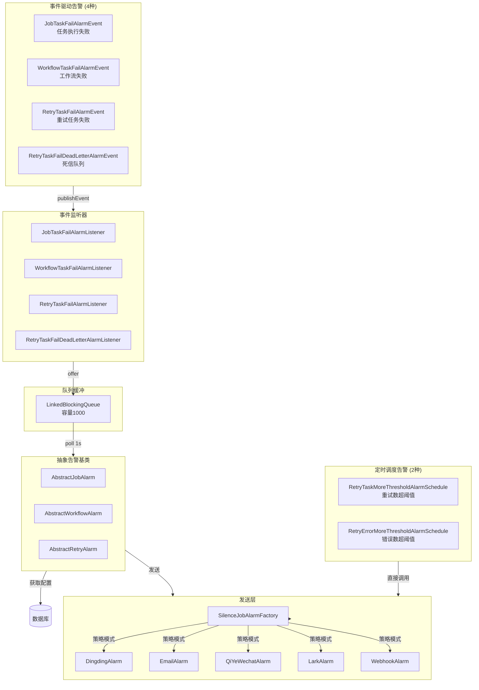
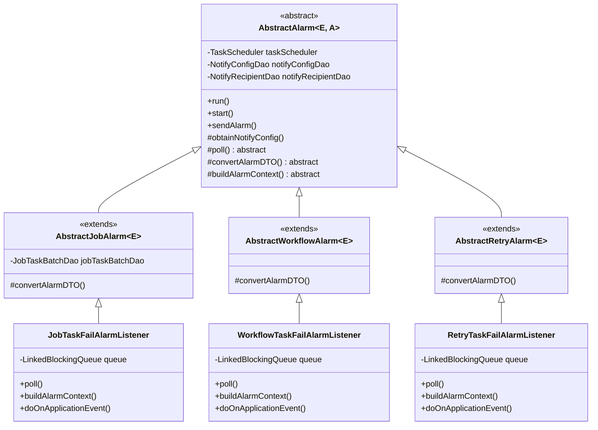
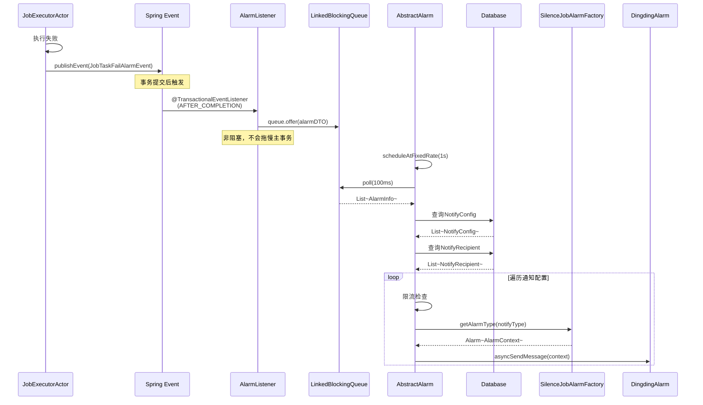
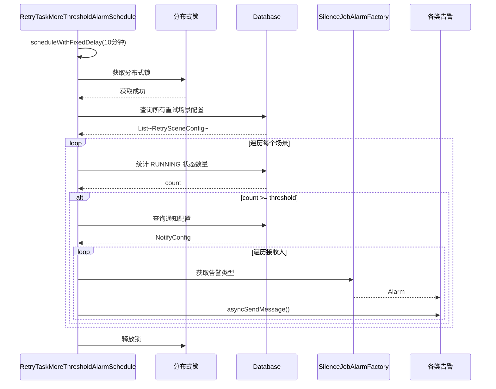
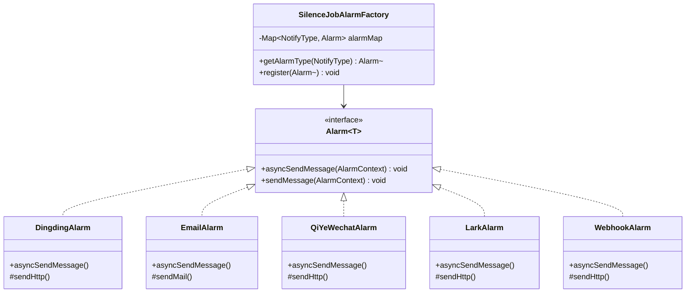
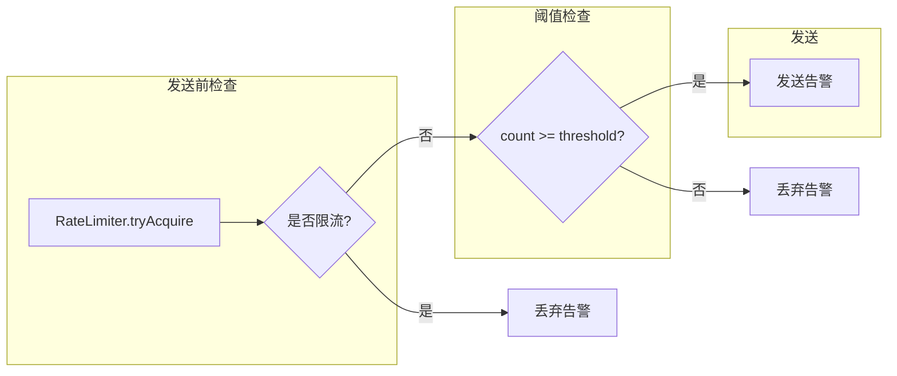
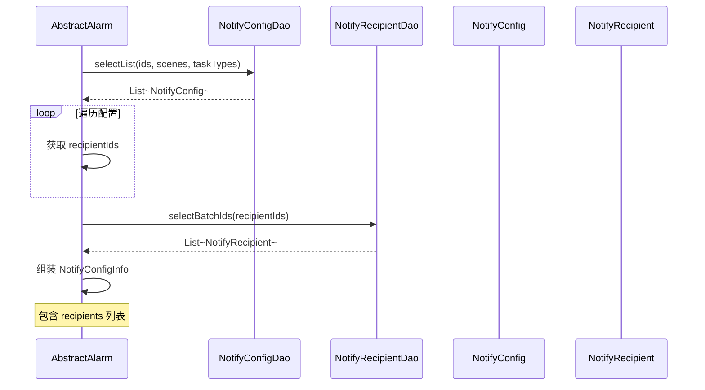
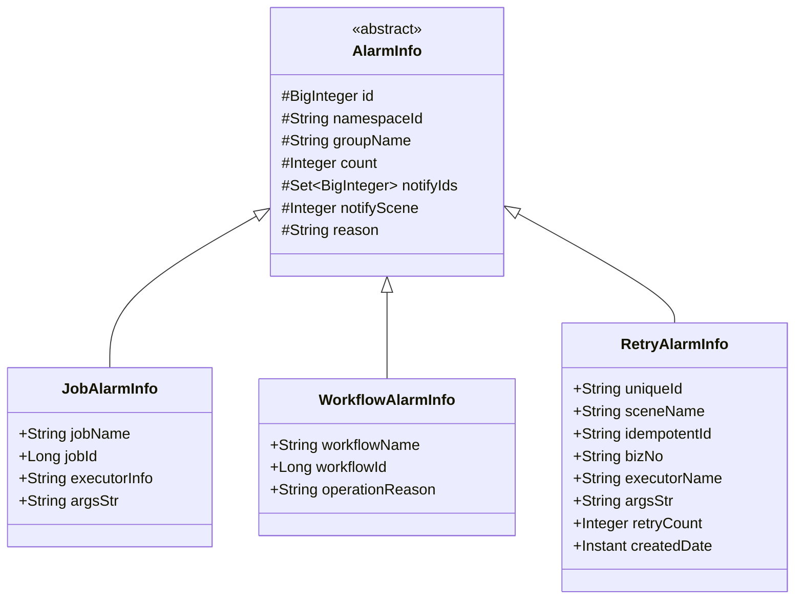

# 告警通知链路详细分析

> 本文档详细分析 Silence-Job-Server 的告警通知链路，包括事件驱动、定时调度、队列缓冲等机制。

---

## 一、整体架构

### 1.1 告警架构图



### 1.2 两大告警类别

| 类别 | 触发方式 | 处理方式 | 延迟 |
|------|----------|----------|------|
| **事件驱动** | Spring Event 发布 | 事务提交后异步入队 → 定时轮询发送 | ~1秒 |
| **定时调度** | 定时任务扫描 | 直接查询数据库 → 阈值判断 → 发送 | 10分钟 |

---

## 二、核心类层次结构

### 2.1 抽象告警基类



---

## 三、事件驱动告警链路

### 3.1 完整调用链



### 3.2 事件发布时机

| 事件 | 发布位置 | 触发条件 |
|------|----------|----------|
| `JobTaskFailAlarmEvent` | `JobExecutorActor:163` | 任务执行失败/超时/无客户端 |
| `WorkflowTaskFailAlarmEvent` | `WorkflowExecutorActor:133` | Workflow执行器异常 |
| `WorkflowTaskFailAlarmEvent` | `CallbackWorkflowExecutor:155` | 回调Workflow失败 |
| `WorkflowTaskFailAlarmEvent` | `DecisionWorkflowExecutor:118` | 决策Workflow失败 |
| `WorkflowTaskFailAlarmEvent` | `WorkflowBatchHandler:192,236` | Workflow批次失败/回退 |
| `WorkflowTaskFailAlarmEvent` | `RunningWorkflowPrepareHandler:65` | Workflow运行检查失败 |
| `WorkflowTaskFailAlarmEvent` | `WorkflowTimeoutCheckTask:51` | Workflow超时 |
| `RetryTaskFailAlarmEvent` | `RetryFailureHandler:108` | 重试任务执行失败 |
| `RetryTaskFailAlarmEvent` | `RetryExecutor:107` | 重试调度执行失败 |
| `RetryTaskFailDeadLetterAlarmEvent` | `CleanerSchedule:226` | 死信队列迁移完成 |

### 3.3 Listener 实现详解

**JobTaskFailAlarmListener 示例**:

```java
@Component
public class JobTaskFailAlarmListener extends AbstractJobAlarm<JobTaskFailAlarmEvent> {

    // 消息队列，容量1000
    private final LinkedBlockingQueue<JobTaskFailAlarmEventDTO> queue =
            new LinkedBlockingQueue<>(1000);

    // 1. 事务提交后异步触发
    @Override
    @TransactionalEventListener(fallbackExecution = true,
                                phase = TransactionPhase.AFTER_COMPLETION)
    public void doOnApplicationEvent(JobTaskFailAlarmEvent event) {
        // 放入队列，非阻塞
        queue.offer(event.getJobTaskFailAlarmEventDTO());
    }

    // 2. 每秒轮询发送
    @Override
    public void start() {
        // 每1秒执行一次
        taskScheduler.scheduleAtFixedRate(this, Duration.parse("PT1S"));
    }

    // 3. 轮询队列
    @Override
    protected List<JobAlarmInfo> poll() throws InterruptedException {
        // 无数据时阻塞100ms
        JobTaskFailAlarmEventDTO dto = queue.poll(100, TimeUnit.MILLISECONDS);
        if (dto == null) return Lists.newArrayList();

        // 批量拉取最多200条
        ArrayList<JobTaskFailAlarmEventDTO> lists = Lists.newArrayList(dto);
        queue.drainTo(lists, 200);
        return JobTaskConverter.INSTANCE.toJobTaskFailAlarmEventDTO(lists);
    }
}
```

---

## 四、定时调度告警链路

### 4.1 重试数超阈值告警

**类**: `RetryTaskMoreThresholdAlarmSchedule`



### 4.2 分布式锁保护

```java
// 定时调度使用分布式锁避免多节点重复执行
@Component
public class RetryTaskMoreThresholdAlarmSchedule extends AbstractRetryTaskAlarmSchedule {

    @Override
    public String lockName() {
        return "retryTaskMoreThreshold";  // 锁名称
    }

    @Override
    public String lockAtMost() {
        return "PT10M";  // 锁最多持有10分钟
    }

    @Override
    public String lockAtLeast() {
        return "PT1M";  // 锁最少持有1分钟
    }
}
```

---

## 五、通知发送层

### 5.1 策略模式实现



### 5.2 各通知方式对比

| 通知方式 | 实现类 | 协议 | 特点 |
|----------|--------|------|------|
| **钉钉** | `DingdingAlarm` | Webhook + Markdown | 支持@人 |
| **邮件** | `EmailAlarm` | SMTP | 支持HTML |
| **企业微信** | `QiYeWechatAlarm` | Webhook + Markdown | 限制4096字节 |
| **飞书** | `LarkAlarm` | Webhook + Card | 红色header |
| **Webhook** | `WebhookAlarm` | HTTP POST + Secret | 自定义扩展 |

### 5.3 工厂注册机制

```java
// 各实现类通过 InitializingBean 自动注册
@Component
public class DingdingAlarm implements Alarm<AlarmContext> {

    @Override
    public void afterPropertiesSet() throws Exception {
        SilenceJobAlarmFactory.register(this);
    }

    @Override
    public void asyncSendMessage(AlarmContext context) {
        // 异步发送钉钉消息
    }
}
```

---

## 六、消息构建与发送

### 6.1 消息模板格式

```java
// 钉钉/企业微信/飞书使用 Markdown 格式
private static final String MESSAGES_FORMATTER = """
<font face=微软雅黑 color=#ff0000 size=4>{}环境 Job任务执行失败</font>

> 空间ID:{}
> 组名称:{}
> 任务名称:{}
> 执行器名称:{}
> 通知场景:{}
> 失败原因:{}
> 方法参数:{}
> 时间:{}
""";
```

### 6.2 AlarmContext 构建

```java
// 构建告警上下文
AlarmContext context = AlarmContext.build()
    .text(MESSAGES_FORMATTER,
          EnvironmentUtils.getActiveProfile(),  // 环境
          alarmDTO.getNamespaceId(),             // 空间ID
          alarmDTO.getGroupName(),               // 组名称
          alarmDTO.getJobName(),                 // 任务名称
          alarmDTO.getExecutorInfo(),            // 执行器
          notifyScene.getDescription(),           // 场景描述
          alarmDTO.getReason(),                   // 失败原因
          alarmDTO.getArgsStr(),                 // 执行参数
          DateUtils.toNowFormat())               // 时间
    .title("{}环境 JOB任务失败", EnvironmentUtils.getActiveProfile())
    .notifyAttribute(recipientInfo.getNotifyAttribute());

// 异步发送
alarm.asyncSendMessage(context);
```

---

## 七、限流与阈值控制

### 7.1 限流机制



### 7.2 限流实现

```java
protected void sendAlarm(NotifyConfigInfo notifyConfig, A alarmDTO) {
    // 1. 限流检查
    if (notifyConfig.getRateLimiterStatus()) {
        RateLimiter rateLimiter = getRateLimiter(
            String.valueOf(notifyConfig.getId()),
            notifyConfig.getRateLimiterThreshold()
        );
        // 每秒最多发送 rateLimiterThreshold 个
        if (!rateLimiter.tryAcquire(1, TimeUnit.SECONDS)) {
            return;  // 丢弃
        }
    }

    // 2. 阈值检查
    if (Objects.nonNull(alarmDTO.getCount())
            && alarmDTO.getCount() < notifyConfig.getNotifyThreshold()) {
        return;  // 丢弃
    }

    // 3. 发送
    for (RecipientInfo recipientInfo : notifyConfig.getRecipientInfos()) {
        Alarm<AlarmContext> alarm = SilenceJobAlarmFactory.getAlarmType(
            recipientInfo.getNotifyType()
        );
        alarm.asyncSendMessage(context);
    }
}
```

### 7.3 Guava RateLimiter 缓存

```java
// CacheNotifyRateLimiter.java
public class CacheNotifyRateLimiter {
    // Guava Cache 存储 RateLimiter，30分钟过期
    private static final Cache<String, RateLimiter> CACHE = Caffeine.newBuilder()
            .expireAfterAccess(30, TimeUnit.MINUTES)
            .build();

    public static RateLimiter getRateLimiterByKey(String key) {
        return CACHE.getIfPresent(key);
    }

    public static void put(String key, RateLimiter rateLimiter) {
        CACHE.put(key, rateLimiter);
    }
}
```

---

## 八、告警配置获取

### 8.1 配置查询流程



### 8.2 多对多关系查询

```sql
-- 查询通知配置及其接收人
SELECT nc.*, ncr.recipient_id
FROM sj_notify_config nc
JOIN sj_notify_config_recipient_relation ncr ON nc.id = ncr.notify_config_id
WHERE nc.notify_status = true
  AND nc.notify_scene IN (?)
  AND nc.system_task_type IN (?)
  AND nc.id IN (?)
```

---

## 九、告警数据模型

### 9.1 AlarmInfo 层次结构



### 9.2 通知场景枚举

```java
// JobNotifyScene
public enum JobNotifyScene {
    JOB_TASK_ERROR(1, "JOB任务执行失败"),
    JOB_TIMEOUT_ERROR(2, "JOB任务超时"),
    JOB_NO_CLIENT_NODES_ERROR(3, "JOB任务无可用客户端节点");

    // ...
}

// WorkflowNotifyScene
public enum WorkflowNotifyScene {
    WORKFLOW_TASK_ERROR(1, "Workflow任务执行失败"),
    WORKFLOW_TIMEOUT(2, "Workflow执行超时"),
    WORKFLOW_ALL_SUCCESS(3, "Workflow全部成功");

    // ...
}

// RetryNotifyScene
public enum RetryNotifyScene {
    RETRY_TASK_ERROR(1, "重试任务执行失败"),
    RETRY_TIMEOUT(2, "重试任务超时"),
    MAX_RETRY(3, "超过最大重试次数"),
    DEAD_LETTER(4, "进入死信队列");

    // ...
}
```

---

## 十、关键文件索引

| 文件 | 路径 | 说明 |
|------|------|------|
| AbstractAlarm | `common/.../alarm/AbstractAlarm.java` | 告警抽象基类 |
| AbstractJobAlarm | `common/.../alarm/AbstractJobAlarm.java` | JOB告警基类 |
| AbstractWorkflowAlarm | `common/.../alarm/AbstractWorkflowAlarm.java` | Workflow告警基类 |
| AbstractRetryAlarm | `common/.../alarm/AbstractRetryAlarm.java` | Retry告警基类 |
| JobTaskFailAlarmListener | `job-task/.../alarm/listener/JobTaskFailAlarmListener.java` | JOB失败监听 |
| WorkflowTaskFailAlarmListener | `job-task/.../alarm/listener/WorkflowTaskFailAlarmListener.java` | Workflow失败监听 |
| RetryTaskFailAlarmListener | `retry-task/.../alarm/listener/RetryTaskFailAlarmListener.java` | 重试失败监听 |
| RetryTaskMoreThresholdAlarmSchedule | `retry-task/.../schedule/RetryTaskMoreThresholdAlarmSchedule.java` | 重试数阈值告警 |
| RetryErrorMoreThresholdAlarmSchedule | `retry-task/.../schedule/RetryErrorMoreThresholdAlarmSchedule.java` | 错误数阈值告警 |
| SilenceJobAlarmFactory | silence-job-common JAR | 告警工厂 |
| AlarmContext | silence-job-common JAR | 告警上下文 |

---

## 十一、配置建议

### 11.1 告警阈值配置

| 场景 | 建议阈值 | 说明 |
|------|----------|------|
| 任务执行失败 | 1 | 立即告警 |
| 任务超时 | 3 | 累计3次才告警 |
| 无客户端节点 | 1 | 立即告警 |
| 重试数超阈值 | 10-100 | 根据业务调整 |
| 错误数超阈值 | 5-20 | 根据业务调整 |

### 11.2 限流配置

| 通知渠道 | 建议阈值 | 说明 |
|----------|----------|------|
| 钉钉 | 10/秒 | 避免刷屏 |
| 企业微信 | 10/秒 | 避免刷屏 |
| 飞书 | 10/秒 | 避免刷屏 |
| 邮件 | 60/秒 | 通常无限制 |
| Webhook | 自定义 | 根据目标服务能力 |

---

## 十二、设计亮点

### 12.1 异步解耦
- 事件监听器使用 `@TransactionalEventListener` 确保事务提交后才处理
- `queue.offer()` 非阻塞，不会拖慢主业务流程

### 12.2 批量处理
- 定时任务每1秒轮询，最多拉取200条
- 减少数据库查询次数

### 12.3 限流保护
- Guava RateLimiter + Caffeine Cache
- 30分钟缓存过期，自动刷新

### 12.4 阈值控制
- 支持按次数阈值过滤告警
- 避免告警风暴

### 12.5 分布式锁
- 定时任务使用分布式锁
- 避免多节点重复执行
