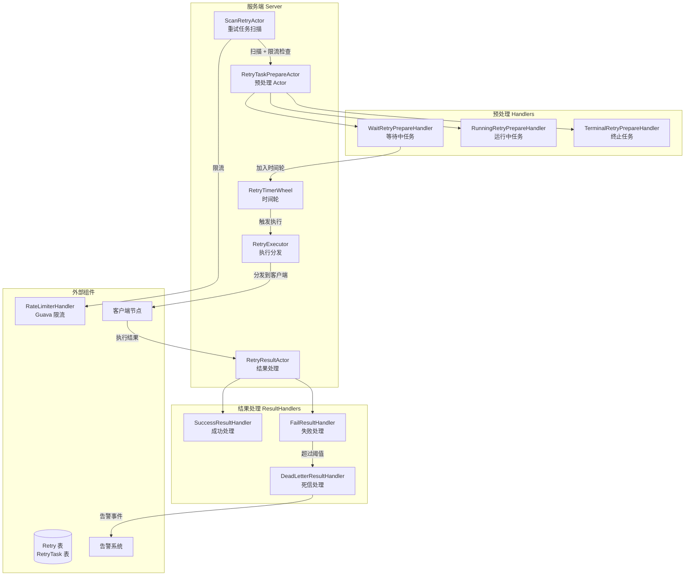
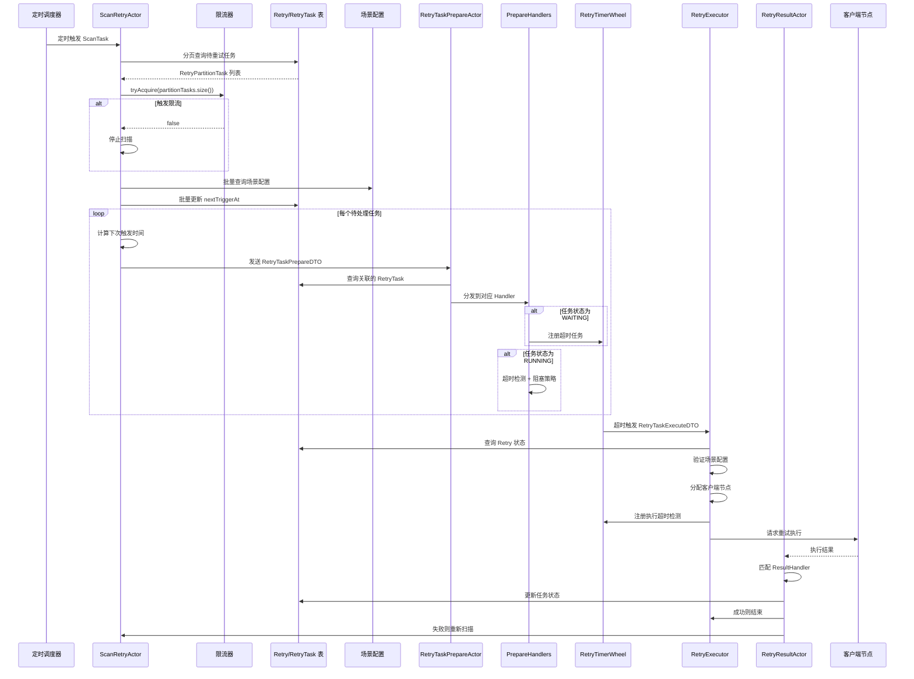
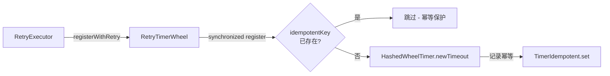

# 重试子系统完整链路分析

> 本文档深入分析 silence-job-server 中独立于 Job/Workflow 的重试（Retry）子系统，涵盖其 Actor 调度链路、退避策略、时间轮机制、死信队列、速率限制等核心组件。

## 目录

- [1. 整体架构概览](#1-整体架构概览)
- [2. Actor 调度链路详解](#2-actor-调度链路详解)
- [3. 核心组件源码解析](#3-核心组件源码解析)
- [4. 时间轮超时检测机制](#4-时间轮超时检测机制)
- [5. 阻塞策略与并发控制](#5-阻塞策略与并发控制)
- [6. 限流与幂等控制](#6-限流与幂等控制)
- [7. 告警通知链路](#7-告警通知链路)
- [8. 设计模式总结](#8-设计模式总结)

---

## 1. 整体架构概览

### 1.1 与 Job/Workflow 的区别

| 维度 | Job/Workflow 任务 | Retry 重试任务 |
|------|------------------|---------------|
| **触发方式** | 定时调度扫描 | 业务主动创建 + 自动重试 |
| **执行场景** | 主动执行一次 | 失败后自动重试多次 |
| **阻塞策略** | 单机阻塞 | 支持并发/覆盖/丢弃 |
| **时间轮配置** | 512 ticks, 1s tick | 512 ticks, 500ms tick |
| **核心目标** | 按时执行 | 可靠性保障 |

### 1.2 架构图



---

## 2. Actor 调度链路详解

### 2.1 完整链路时序图



### 2.2 链路核心入口

#### ScanRetryActor - 重试任务扫描

```java
@Component(ActorGenerator.SCAN_RETRY_ACTOR)
@Scope(ConfigurableBeanFactory.SCOPE_PROTOTYPE)
public class ScanRetryActor extends AbstractActor {

    private void doScan(ScanTask scanTask) {
        // 分页扫描，cursor 游标方式
        PartitionTaskUtils.process(
            startId -> listAvailableTasks(startId, scanTask.getBuckets()),
            this::processRetryPartitionTasks,
            this::stopCondition,
            0
        );
    }

    // 停止条件：空数据 或 触发限流
    private boolean stopCondition(List<? extends PartitionTask> partitionTasks) {
        if (CollectionUtils.isEmpty(partitionTasks)) return true;
        return !rateLimiterHandler.tryAcquire(partitionTasks.size());
    }
}
```

**关键特性**：
- **分页游标**：使用 ID > startId 实现高效分页
- **Bucket 过滤**：只处理分配给当前节点的 Bucket
- **限流保护**：每批次任务数受 RateLimiter 控制
- **触发时间计算**：基于退避策略计算下次执行时间

---

## 3. 核心组件源码解析

### 3.1 ScanRetryActor - 任务扫描与分发

**文件位置**：`silence-job-server-retry-task/.../dispatch/ScanRetryActor.java`

```java
public List<RetryPartitionTask> listAvailableTasks(Long startId, Set<Integer> buckets) {
    return retryDao.selectPage(
        new PageDTO<>(0, systemProperties.getRetryPullPageSize()),
        new LambdaQueryWrapper<Retry>()
            .select(Retry::getId, Retry::getNextTriggerAt, ...)  // 只查必要字段
            .eq(Retry::getRetryStatus, RetryStatus.RUNNING.getValue())
            .in(Retry::getBucketIndex, buckets)                    // Bucket 分片
            .le(Retry::getNextTriggerAt, now + SCHEDULE_PERIOD)    // 预拉取窗口
            .orderByAsc(Retry::getId)
    );
}
```

**关键逻辑**：
1. **预拉取窗口**：拉取未来一个调度周期内的任务
2. **场景配置校验**：过滤掉已关闭场景的任务
3. **分布式限流**：使用 Guava RateLimiter 全局限流

### 3.2 RetryTaskPrepareActor - 预处理分发

**文件位置**：`silence-job-server-retry-task/.../dispatch/RetryTaskPrepareActor.java`

```java
private void doPrepare(RetryTaskPrepareDTO prepareDTO) {
    // 查询关联的子任务
    List<RetryTask> retryTasks = retryTaskDao.selectList(
        new LambdaQueryWrapper<RetryTask>()
            .eq(RetryTask::getRetryId, prepareDTO.getRetryId())
            .in(RetryTask::getTaskStatus, NOT_COMPLETE)
    );

    boolean onlyTimeoutCheck = false;
    for (RetryTask retryTask : retryTasks) {
        prepareDTO.setRetryTaskId(retryTask.getId());

        // 根据任务状态匹配 Handler
        for (RetryPrePareHandler handler : retryPrePareHandlers) {
            if (handler.matches(retryTask.getTaskStatus())) {
                handler.handle(prepareDTO);
                break;
            }
        }

        // 除第一个任务外，其他仅做超时检测
        onlyTimeoutCheck = true;
    }
}
```

**策略模式应用**：通过 `RetryPrePareHandler` 接口，支持不同状态的任务使用不同处理逻辑。

### 3.3 RetryExecutor - 任务执行分发

**文件位置**：`silence-job-server-retry-task/.../dispatch/RetryExecutor.java`

```java
private void doExecute(RetryTaskExecuteDTO execute) {
    // 1. 验证 Retry 状态
    Retry retry = retryDao.selectOne(wrapper);
    if (retry == null || retry.getRetryStatus() != RUNNING) {
        updateRetryTaskStatus(execute.getRetryTaskId(), CANCEL, NOT_RUNNING_RETRY);
        return;
    }

    // 2. 验证场景配置
    RetrySceneConfig config = retrySceneConfigDao.selectOne(...);
    if (!config.getSceneStatus()) {
        updateRetryTaskStatus(execute.getRetryTaskId(), CANCEL, SCENE_CLOSED);
        return;
    }

    // 3. 分配客户端节点
    RegisterNodeInfo serverNode = clientNodeAllocateHandler.getServerNode(...);

    // 4. 注册超时检测
    RetryTimerWheel.registerWithRetry(
        () -> new RetryTimeoutCheckTask(...),
        Duration.ofMillis(executorTimeout + 500)  // 加 500ms 缓冲
    );

    // 5. 发送执行请求
    ActorRef actorRef = ActorGenerator.retryRealTaskExecutorActor();
    actorRef.tell(retryExecutorDTO, actorRef);
}
```

### 3.4 RetryResultActor - 结果处理

**文件位置**：`silence-job-server-retry-task/.../dispatch/RetryResultActor.java`

```java
public class RetryResultActor extends AbstractActor {

    private void doResult(RetryExecutorResultDTO result) {
        // 构建结果上下文
        RetryResultContext context = RetryTaskConverter.toRetryResultContext(result);

        // 责任链模式：依次尝试每个 Handler
        for (RetryResultHandler handler : retryResultHandlers) {
            if (handler.supports(context)) {
                handler.handle(context);
            }
        }
    }
}
```

---

## 4. 时间轮超时检测机制

### 4.1 RetryTimerWheel 配置

**文件位置**：`silence-job-server-task-common/.../timer/AbstractTimerWheel.java`

```java
public class RetryTimerWheel extends AbstractTimerWheel {

    private static final RetryTimerWheel INSTANCE;

    static {
        TimerWheelConfig config = TimerWheelConfig.builder()
            .tickDuration(500)           // 500ms 刻度（比 Job 更精细）
            .ticksPerWheel(512)          // 512 槽位
            .corePoolSize(16)            // 16 核心线程
            .maximumPoolSize(16)
            .threadNamePrefix("retry-task-timer-wheel-")
            .idempotentConcurrencyLevel(16)
            .idempotentExpireSeconds(20) // 幂等缓存 20s 过期
            .build();
        INSTANCE = new RetryTimerWheel(config);
    }

    public static synchronized void registerWithRetry(
            Supplier<TimerTask<String>> task, Duration delay) {
        INSTANCE.register(task, delay);
    }
}
```

### 4.2 时间轮注册流程



### 4.3 RetryTimerTask - 定时任务实现

```java
public class RetryTimerTask extends AbstractTimerTask {

    public static final String IDEMPOTENT_KEY_PREFIX = "retry_task_{0}";

    @Override
    public void doRun(final Timeout timeout) {
        // 构建执行 DTO
        RetryTaskExecuteDTO taskExecuteDTO = RetryTaskConverter.toRetryTaskExecuteDTO(context);

        // 发送到执行 Actor
        ActorRef actorRef = ActorGenerator.retryTaskExecutorActor();
        actorRef.tell(taskExecuteDTO, actorRef);
    }

    @Override
    public String idempotentKey() {
        return MessageFormat.format(IDEMPOTENT_KEY_PREFIX, context.getRetryTaskId());
    }
}
```

---

## 5. 阻塞策略与并发控制

### 5.1 阻塞策略类型

| 策略 | 枚举值 | 行为 |
|------|--------|------|
| **并发执行** | CONCURRENCY | 创建新的子任务，并发执行 |
| **覆盖** | OVERLAY | 覆盖正在执行的任务 |
| **丢弃** | DISCARD | 直接丢弃新任务 |
| **单机阻塞** | BLOCK | 串行执行，前一个完成才执行下一个 |

### 5.2 策略工厂

```java
public final class RetryBlockStrategyFactory {
    private static final ConcurrentHashMap<RetryBlockStrategy, BlockStrategy> CACHE =
        new ConcurrentHashMap<>();

    public static BlockStrategy getBlockStrategy(RetryBlockStrategy blockStrategy) {
        return CACHE.get(blockStrategy);
    }
}
```

### 5.3 并发策略实现

```java
@Component
public class ConcurrencyRetryBlockStrategy extends AbstracJobBlockStrategy {

    @Override
    public void doBlock(final BlockStrategyContext context) {
        // 重新生成子任务
        RetryTaskGeneratorDTO generatorDTO = RetryTaskConverter.toRetryTaskGeneratorDTO(context);
        retryTaskGeneratorHandler.generateRetryTask(generatorDTO);
    }

    @Override
    protected RetryBlockStrategy blockStrategyEnum() {
        return RetryBlockStrategy.CONCURRENCY;
    }
}
```

---

## 6. 限流与幂等控制

### 6.1 RateLimiterHandler - 全局限流

```java
@Component
public class RateLimiterHandler implements InitializingBean {
    private RateLimiter rateLimiter;

    // 基于 Guava RateLimiter 实现令牌桶限流
    public boolean tryAcquire(int permits) {
        // 500ms 超时，获取令牌
        return rateLimiter.tryAcquire(permits, 500L, TimeUnit.MILLISECONDS);
    }

    @Override
    public void afterPropertiesSet() throws Exception {
        rateLimiter = RateLimiter.create(systemProperties.getMaxDispatchCapacity());
    }

    // 动态刷新限流阈值
    public void refreshRate(int maxDispatchCapacity) {
        rateLimiter.setRate(maxDispatchCapacity);
    }
}
```

**限流时机**：在 `ScanRetryActor.stopCondition()` 中，每批次任务扫描前进行限流检查。

### 6.2 TimerIdempotent - 时间轮幂等

```java
public class TimerIdempotent {
    // 基于 Caffeine/Guava Cache 实现
    private final Cache<String, Boolean> idempotentCache;

    public void set(String idempotentKey) {
        idempotentCache.put(idempotentKey, true);
    }

    public boolean isExist(String idempotentKey) {
        return idempotentCache.getIfPresent(idempotentKey) != null;
    }

    public void clear(String idempotentKey) {
        idempotentCache.invalidate(idempotentKey);
    }
}
```

**幂等场景**：
1. 时间轮任务重复触发
2. 网络重试导致的任务重复执行

---

## 7. 告警通知链路

### 7.1 告警事件发布

```java
// RetryExecutor.java
if (无客户端节点) {
    RetryTaskFailAlarmEventDTO dto = RetryTaskConverter.toRetryTaskFailAlarmEventDTO(
        retry, "无客户端节点", JobNotifyScene.RETRY_NO_CLIENT_NODES_ERROR);
    SilenceSpringContext.getContext().publishEvent(
        new RetryTaskFailAlarmEvent(dto));
}
```

### 7.2 事务后告警监听

```java
@Component
public class RetryTaskFailAlarmListener extends AbstractRetryAlarm<RetryTaskFailAlarmEvent>
        implements Runnable, Lifecycle {

    private final LinkedBlockingQueue<RetryTaskFailAlarmEventDTO> queue =
        new LinkedBlockingQueue<>(1000);

    // 事务完成后处理
    @TransactionalEventListener(fallbackExecution = true,
            phase = TransactionPhase.AFTER_COMPLETION)
    public void doOnApplicationEvent(RetryTaskFailAlarmEvent event) {
        queue.offer(event.getRetryTaskFailAlarmEventDTO());
    }

    @Override
    protected List<RetryAlarmInfo> poll() throws InterruptedException {
        // 无数据时阻塞 100ms
        RetryTaskFailAlarmEventDTO dto = queue.poll(100, TimeUnit.MILLISECONDS);
        if (dto == null) return Lists.newArrayList();

        // 批量拉取最多 200 条
        List<RetryTaskFailAlarmEventDTO> lists = Lists.newArrayList(dto);
        queue.drainTo(lists, 200);
        return CollectionUtils.transformToList(lists, converter::toRetryAlarmInfo);
    }
}
```

### 7.3 阈值告警定时调度

```java
@Component
public class RetryTaskMoreThresholdAlarmSchedule
        extends AbstractRetryTaskAlarmSchedule implements Lifecycle {

    @Override
    public void start() {
        // 每 10 分钟执行一次
        taskScheduler.scheduleWithFixedDelay(
            this::execute,
            Instant.now(),
            Duration.parse("PT10M")
        );
    }

    @Override
    public String lockName() { return "retryTaskMoreThreshold"; }
    @Override
    public String lockAtMost() { return "PT10M"; }
    @Override
    public String lockAtLeast() { return "PT1M"; }

    @Override
    protected void doSendAlarm(RetrySceneConfigPartitionTask task,
                                Map<BigInteger, NotifyConfigDTO> notifyConfigInfo) {
        // 统计场景的重试数量
        long count = retryDao.selectCount(
            new LambdaQueryWrapper<Retry>()
                .eq(Retry::getNamespaceId, task.getNamespaceId())
                .eq(Retry::getGroupName, task.getGroupName())
                .eq(Retry::getSceneName, task.getSceneName())
                .eq(Retry::getRetryStatus, RetryStatus.RUNNING)
        );

        for (BigInteger notifyId : task.getNotifyIds()) {
            NotifyConfigDTO config = notifyConfigInfo.get(notifyId);
            if (config.getNotifyThreshold() > 0 && count >= config.getNotifyThreshold()) {
                // 发送告警通知
                AlarmContext context = AlarmContext.build()
                    .text(retryTaskMoreThresholdTextMessageFormatter, ...)
                    .title("场景重试数量超过阈值", ...);
                SilenceJobAlarmFactory.getAlarmType(recipientInfo.getNotifyType())
                    .asyncSendMessage(context);
            }
        }
    }
}
```

---

## 8. 设计模式总结

### 8.1 策略模式

```java
// 阻塞策略
public interface RetryPrePareHandler {
    boolean matches(RetryTaskStatus status);
    void handle(RetryTaskPrepareDTO jobPrepareDTO);
}

// 结果处理
public interface RetryResultHandler {
    boolean supports(RetryResultContext context);
    void handle(RetryResultContext context);
}
```

### 8.2 责任链模式

```java
// RetryResultActor 依次尝试所有 Handler
for (RetryResultHandler handler : retryResultHandlers) {
    if (handler.supports(context)) {
        handler.handle(context);
    }
}
```

### 8.3 工厂模式

```java
// 阻塞策略工厂
public final class RetryBlockStrategyFactory {
    private static final ConcurrentHashMap<RetryBlockStrategy, BlockStrategy> CACHE =
        new ConcurrentHashMap<>();

    public static BlockStrategy getBlockStrategy(RetryBlockStrategy blockStrategy) {
        return CACHE.get(blockStrategy);
    }
}
```

### 8.4 模板方法模式

```java
// 抽象结果处理器
public abstract class AbstractRetryResultHandler implements RetryResultHandler {
    @Override
    public void handle(RetryResultContext context) {
        doHandler(context);  // 模板方法
    }

    protected abstract void doHandler(RetryResultContext context);
}
```

### 8.5 事件驱动模式

```java
// Spring Event 发布
SilenceSpringContext.getContext().publishEvent(new RetryTaskFailAlarmEvent(dto));

// @TransactionalEventListener 监听
@TransactionalEventListener(phase = TransactionPhase.AFTER_COMPLETION)
public void doOnApplicationEvent(RetryTaskFailAlarmEvent event) {
    queue.offer(event.getDTO());
}
```

---

## 附录：关键配置参数

| 参数 | 默认值 | 说明 |
|------|--------|------|
| `retryPullPageSize` | 1000 | 重试任务分页大小 |
| `maxDispatchCapacity` | 2000 | 全局限流阈值（QPS） |
| `executorTimeout` | 30min | 执行超时时间 |
| `SCHEDULE_PERIOD` | 1min | 调度周期 |
| `RetryTimerWheel tickDuration` | 500ms | 时间轮刻度 |
| `RetryTimerWheel ticksPerWheel` | 512 | 时间轮槽位数 |
| `idempotentExpireSeconds` | 20s | 幂等缓存过期时间 |
