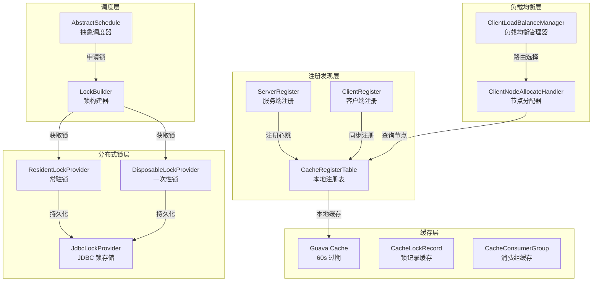
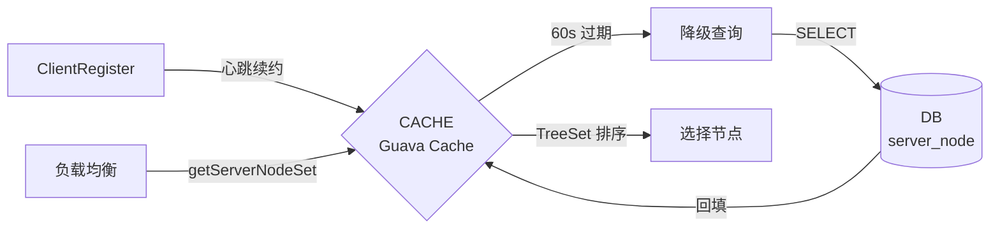

# 分布式基础设施层分析

> 本文档深入分析 silence-job-server 中的分布式基础设施，涵盖服务注册发现、负载均衡、分布式锁三大核心组件。

## 目录

- [1. 整体架构概览](#1-整体架构概览)
- [2. 服务注册与发现](#2-服务注册与发现)
- [3. 本地缓存与降级机制](#3-本地缓存与降级机制)
- [4. 负载均衡策略](#4-负载均衡策略)
- [5. 分布式锁实现](#5-分布式锁实现)
- [6. 定时任务锁机制](#6-定时任务锁机制)
- [7. 设计模式总结](#7-设计模式总结)

---

## 1. 整体架构概览

### 1.1 核心组件关系



### 1.2 核心设计原则

| 设计点 | 实现方式 | 优势 |
|--------|---------|------|
| **注册续约** | 定时续约 + DB 持久化 | 节点故障自动过期 |
| **跨 POD 同步** | 心跳队列 + 多节点并行拉取 | 高可用注册表 |
| **本地缓存** | Guava Cache 60s 过期 | 读性能优化 |
| **降级查询** | 缓存未命中 → DB 查询 | 容错能力 |
| **负载均衡** | 7 种路由策略 | 灵活性 |
| **分布式锁** | JDBC + 版本号乐观锁 | 轻量级实现 |

---

## 2. 服务注册与发现

### 2.1 服务端注册 (ServerRegister)

**文件位置**：`silence-job-server-common/.../register/ServerRegister.java`

#### 核心流程

```java
@Component
public class ServerRegister extends AbstractRegister {

    // 雪花算法生成唯一 ID
    public static final String CURRENT_CID = IdUtil.getSnowflakeNextIdStr();

    @Override
    public void start() {
        // 每 20 秒续约一次
        serverRegisterNode.scheduleAtFixedRate(() -> {
            this.register(new RegisterContext());
        }, 0, DELAY_TIME * 2 / 3, TimeUnit.SECONDS);  // 30 * 2/3 = 20s
    }

    @Override
    protected void beforeProcessor(RegisterContext context) {
        context.setHostId(CURRENT_CID);                    // 雪花 ID
        context.setHostIp(NetUtils.getLocalIpStr());        // 本机 IP
        context.setHostPort(systemProperties.getServerPort()); // 服务端口
        context.setGroupName("DEFAULT_SERVER");
        context.setNamespaceId("DEFAULT_SERVER_NAMESPACE_ID");
    }

    @Override
    protected Instant getExpireAt() {
        // 30 秒后过期
        return Instant.now().plusSeconds(DELAY_TIME);
    }
}
```

#### 注册时同步客户端信息

```java
@Override
protected void afterProcessor(ServerNode serverNode) {
    // 获取当前 POD 消费的组
    ConcurrentMap<String, Set<String>> allConsumerGroupName =
        CacheConsumerGroup.getAllConsumerGroupName();

    // 查询这些组下的所有客户端节点
    List<ServerNode> serverNodes = serverNodeDao.selectList(
        new LambdaQueryWrapper<ServerNode>()
            .eq(ServerNode::getNodeType, NodeType.CLIENT)
            .in(ServerNode::getNamespaceId, namespaceIdSets)
            .in(ServerNode::getGroupName, allConsumerGroupName.keySet()));

    // 刷新本地缓存
    for (ServerNode node : serverNodes) {
        CacheRegisterTable.addOrUpdate(node);
        CacheConsumerGroup.addOrUpdate(node.getGroupName(), node.getNamespaceId());
    }
}
```

### 2.2 客户端注册 (ClientRegister)

**文件位置**：`silence-job-server-common/.../register/ClientRegister.java`

#### 心跳队列机制

```java
// 心跳队列：队首用于续约，队尾用于新增
protected static final LinkedBlockingDeque<ServerNode> QUEUE =
    new LinkedBlockingDeque<>(1000);

@Override
protected boolean doRegister(RegisterContext context, ServerNode serverNode) {
    if (HTTP_PATH.BEAT.equals(context.getUri())) {
        return QUEUE.offerFirst(serverNode);  // 心跳 → 队首
    }
    return QUEUE.offerLast(serverNode);       // 新增 → 队尾
}

// 获取待续约节点
public static List<ServerNode> getExpireNodes() {
    ServerNode serverNode = QUEUE.poll();
    if (Objects.nonNull(serverNode)) {
        List<ServerNode> lists = new ArrayList<>();
        lists.add(serverNode);
        QUEUE.drainTo(lists, 256);  // 批量拉取
        return lists;
    }
    return null;
}
```

#### 跨 POD 同步机制

```java
@Component
public class RefreshNodeSchedule extends AbstractSchedule {

    private void doExecute() {
        // 1. 查询所有在线服务端节点
        List<ServerNode> serverNodes = serverNodeDao.selectList(...);

        // 2. 排除当前节点
        serverNodes = StreamUtils.filter(serverNodes,
            node -> !node.getHostId().equals(ServerRegister.CURRENT_CID));

        // 3. 并行拉取其他 POD 的客户端注册信息
        List<ServerNode> allClientList = pullRemoteNodeClientRegisterInfo(serverNodes);

        // 4. 批量更新 DB
        refreshExpireAt(waitRefreshDBClientNodes);
    }

    // 并行拉取：4 线程池，1 秒超时
    private List<ServerNode> pullRemoteNodeClientRegisterInfo(
            List<ServerNode> serverNodes) {
        List<Future<String>> futures = new ArrayList<>();
        for (ServerNode serverNode : serverNodes) {
            Future<String> future = refreshNodePool.submit(() -> {
                RegisterNodeInfo nodeInfo = buildNodeInfo(serverNode);
                CommonRpcClient rpcClient = buildRpcClient(nodeInfo);
                ApiResult<String> result = rpcClient.pullRemoteNodeClientRegisterInfo(...);
                return result.getData();
            });
            futures.add(future);
        }
        // 收集结果
        return futures.stream()
            .map(f -> {
                try {
                    String json = f.get(1, TimeUnit.SECONDS);
                    return JSON.parseArray(json, ServerNode.class);
                } catch (Exception e) {
                    return new ArrayList<ServerNode>();
                }
            })
            .flatMap(List::stream)
            .distinct()
            .collect(Collectors.toList());
    }

    public void startScheduler() {
        refreshNodePool = new ThreadPoolExecutor(4, 8, 1,
            TimeUnit.SECONDS, new LinkedBlockingDeque<>(1000));
        // 每 5 秒刷新一次
        taskScheduler.scheduleWithFixedDelay(this::execute,
            Instant.now(), Duration.parse("PT5S"));
    }
}
```

---

## 3. 本地缓存与降级机制

### 3.1 CacheRegisterTable

**文件位置**：`silence-job-server-common/.../cache/CacheRegisterTable.java`

```java
@Component
public class CacheRegisterTable implements Lifecycle {

    // Guava Cache：写后 60 秒过期
    private static final Cache<String, ConcurrentMap<String, RegisterNodeInfo>> CACHE;

    static {
        CACHE = CacheBuilder.newBuilder()
            .concurrencyLevel(Runtime.getRuntime().availableProcessors())
            .expireAfterWrite(60, TimeUnit.SECONDS)  // 60s 过期
            .build();
    }

    // 获取排序的节点集合
    public static Set<RegisterNodeInfo> getServerNodeSet(String groupName,
            String namespaceId) {
        ConcurrentMap<String, RegisterNodeInfo> concurrentMap =
            CACHE.getIfPresent(groupName);

        if (CollectionUtils.isEmpty(concurrentMap)) {
            // 降级：缓存未命中 → 查询 DB
            ServerNodeDao serverNodeDao =
                SilenceSpringContext.getBeanByType(ServerNodeDao.class);
            List<ServerNode> serverNodes = serverNodeDao.selectList(
                new LambdaQueryWrapper<ServerNode>()
                    .eq(ServerNode::getGroupName, groupName));

            // 回填缓存
            for (ServerNode node : serverNodes) {
                CacheRegisterTable.addOrUpdate(node);
            }
            concurrentMap = CACHE.getIfPresent(groupName);
        }

        return new TreeSet<>(concurrentMap.values());  // TreeSet 按 expireAt 排序
    }

    // 过期节点清理
    private static void delExpireNode(
            ConcurrentMap<String, RegisterNodeInfo> concurrentMap) {
        concurrentMap.values().stream()
            .filter(info -> info.getExpireAt().isBefore(
                Instant.now().minusSeconds(ServerRegister.DELAY_TIME +
                    ServerRegister.DELAY_TIME / 3)))  // 30 + 10 = 40s
            .forEach(info -> remove(info.getGroupName(), info.getHostId()));
    }
}
```

### 3.2 缓存架构图



---

## 4. 负载均衡策略

### 4.1 策略总览

**文件位置**：`silence-job-server-common/.../allocate/client/`

| 策略 | 枚举值 | 说明 |
|------|--------|------|
| **一致性哈希** | CONSISTENT_HASH (1) | 虚拟节点 + MD5 哈希 |
| **随机** | RANDOM (2) | 随机选择 |
| **LRU** | LRU (3) | 最近最少使用 |
| **轮询** | ROUND (4) | 顺序循环 |
| **取首** | FIRST (5) | 选择第一个 |
| **取尾** | LAST (6) | 选择最后一个 |

### 4.2 节点分配器

```java
@Component
public class ClientNodeAllocateHandler {

    public RegisterNodeInfo getServerNode(String allocKey, String groupName,
            String namespaceId, Integer routeKey) {

        // 1. 获取分组下的所有节点
        Set<RegisterNodeInfo> serverNodes =
            CacheRegisterTable.getServerNodeSet(groupName, namespaceId);

        // 2. 选择负载均衡策略
        ClientLoadBalance loadBalance =
            ClientLoadBalanceManager.getClientLoadBalance(routeKey);

        // 3. 路由选择 hostId
        Set<String> hostIds = StreamUtils.toSet(serverNodes,
            RegisterNodeInfo::getHostId);
        String hostId = loadBalance.route(allocKey, new TreeSet<>(hostIds));

        // 4. 返回完整节点信息
        return serverNodes.stream()
            .filter(s -> s.getHostId().equals(hostId))
            .findFirst()
            .orElse(null);
    }
}
```

### 4.3 一致性哈希实现

```java
public class ClientLoadBalanceConsistentHash implements ClientLoadBalance {

    private final int virtualNodeCnt;  // 默认 100 个虚拟节点

    @Override
    public String route(String allocKey, TreeSet<String> clientAllAddressSet) {
        // 构建节点集合（含虚拟节点）
        Collection<ClientNode> cidNodes = new ArrayList<>();
        for (String clientAddress : clientAllAddressSet) {
            cidNodes.add(new ClientNode(clientAddress));
        }

        // 创建一致性哈希路由器
        final ConsistentHashRouter<ClientNode> consistentHashRouter =
            new ConsistentHashRouter<>(cidNodes, virtualNodeCnt);

        // 路由到具体节点
        ClientNode clientNode = consistentHashRouter.routeNode(allocKey);
        return clientNode.clientAddress;
    }
}
```

### 4.4 策略管理器

```java
public class ClientLoadBalanceManager {

    public enum AllocationAlgorithmEnum {
        CONSISTENT_HASH(1, new ClientLoadBalanceConsistentHash(100)),
        RANDOM(2, new ClientLoadBalanceRandom()),
        LRU(3, new ClientLoadBalanceLRU(100)),
        ROUND(4, new ClientLoadBalanceRound()),
        FIRST(5, new ClientLoadBalanceFirst()),
        LAST(6, new ClientLoadBalanceLast());

        public static ClientLoadBalance getClientLoadBalance(int routeType) {
            for (AllocationAlgorithmEnum algorithm : values()) {
                if (algorithm.getType() == routeType) {
                    return algorithm.getClientLoadBalance();
                }
            }
            throw CommonErrors.INVALID_PARAMETER.createException(
                "routeType is not existed. routeType:[{}]", routeType);
        }
    }
}
```

---

## 5. 分布式锁实现

### 5.1 锁架构

```mermaid
graph TB
    subgraph 锁接口层
        LP[LockProvider]
    end

    subgraph 锁实现层
        ALP[AbstractLockProvider]
        RLP[ResidentLockProvider<br/>常驻锁]
        DLP[DisposableLockProvider<br/>一次性锁]
    end

    subgraph 存储层
        JLP[JdbcLockProvider<br/>JDBC 实现]
    end

    subgraph 数据层
        DL[(distributed_lock<br/>锁记录表)]
    end

    LP <|-- ALP
    ALP <|-- RLP
    ALP <|-- DLP
    RLP --> JLP
    DLP --> JLP
    JLP -->|INSERT/UPDATE| DL

    LB[LockBuilder] -->|build| LP
```

### 5.2 锁接口定义

```java
public interface LockProvider {
    // 带最小持有时间
    boolean lock(Duration lockAtLeast, Duration lockAtMost);
    // 无最小持有时间
    boolean lock(Duration lockAtMost);
    // 释放锁
    void unlock();
}
```

### 5.3 JDBC 锁存储实现

**文件位置**：`silence-job-server-common/.../lock/persistence/JdbcLockProvider.java`

```java
@Component
@Order(Ordered.HIGHEST_PRECEDENCE)
public class JdbcLockProvider implements LockStorage, Lifecycle {

    @Override
    public boolean createLock(LockConfig lockConfig) {
        return notSupportedTransaction(status -> {
            try {
                DistributedLock distributedLock = new DistributedLock();
                distributedLock.setName(lockConfig.getLockName());
                distributedLock.setLockedBy(ServerRegister.CURRENT_CID);
                distributedLock.setLockedAt(now);
                distributedLock.setLockUntil(lockConfig.getLockAtMost());
                return distributedLockDao.insert(distributedLock) > 0;
            } catch (DuplicateKeyException e) {
                // 锁已存在
                return false;
            }
        });
    }

    @Override
    public boolean renewal(LockConfig lockConfig) {
        // 乐观锁更新：只有 lockUntil <= now 才能更新
        return distributedLockDao.update(distributedLock,
            new LambdaUpdateWrapper<DistributedLock>()
                .eq(DistributedLock::getName, lockConfig.getLockName())
                .le(DistributedLock::getLockUntil, now)) > 0;
    }

    @Override
    public boolean releaseLockWithUpdate(String lockName, Instant lockAtLeast) {
        // 释放时将 lockUntil 设置为 lockAtLeast（防抖动释放）
        for (int i = 0; i < 10; i++) {
            try {
                DistributedLock distributedLock = new DistributedLock();
                distributedLock.setLockedBy(ServerRegister.CURRENT_CID);
                distributedLock.setLockUntil(
                    now.isBefore(lockAtLeast) ? lockAtLeast : now);
                return distributedLockDao.update(distributedLock,
                    new LambdaUpdateWrapper<DistributedLock>()
                        .eq(DistributedLock::getName, lockName)) > 0;
            } catch (Exception e) {
                // 重试 10 次
            }
        }
        return false;
    }

    // 非事务执行，避免锁冲突
    private Boolean notSupportedTransaction(TransactionCallback<Boolean> action) {
        TransactionTemplate template = new TransactionTemplate(platformTransactionManager);
        template.setPropagationBehavior(TransactionDefinition.PROPAGATION_NOT_SUPPORTED);
        return template.execute(action);
    }
}
```

### 5.4 常驻锁 vs 一次性锁

```java
// 常驻锁：支持自动续期，用于长时任务
public class ResidentLockProvider extends AbstractLockProvider {

    @Override
    protected boolean doLockAfter(LockConfig lockConfig) {
        // 尝试续期
        boolean lock = renewal(lockConfig);
        if (lock) {
            CacheLockRecord.addLockRecord(lockName);
        }
        return lock;
    }

    @Override
    protected void doUnlock(LockConfig lockConfig) {
        // 释放时更新 lockUntil
        lockStorage.releaseLockWithUpdate(lockName, lockAtLeast);
    }
}

// 一次性锁：不支持续期，用于短时任务
public class DisposableLockProvider extends AbstractLockProvider {

    @Override
    protected boolean doLockAfter(LockConfig lockConfig) {
        // 获取失败立即返回
        return Boolean.FALSE;
    }

    @Override
    protected void doUnlock(LockConfig lockConfig) {
        // 释放时删除记录
        lockStorage.releaseLockWithDelete(lockName);
    }
}
```

---

## 6. 定时任务锁机制

### 6.1 AbstractSchedule

```java
public abstract class AbstractSchedule implements Schedule {

    @Override
    public void execute() {
        String lockName = lockName();
        String lockAtMost = lockAtMost();
        String lockAtLeast = lockAtLeast();

        // 构建常驻锁
        LockProvider lockProvider = LockBuilder.newBuilder()
            .withResident(lockName)
            .build();

        boolean lock = false;
        try {
            // 获取锁（最小持有时间，最大持有时间）
            lock = lockProvider.lock(
                Duration.parse(lockAtLeast),
                Duration.parse(lockAtMost)
            );

            if (lock) {
                doExecute();  // 执行任务
            }
        } finally {
            if (lock) {
                lockProvider.unlock();  // 释放锁
            } else {
                LockManager.clear();    // 清理线程变量
            }
        }
    }

    // 子类必须实现
    protected abstract void doExecute();
    protected abstract String lockName();    // 锁名称
    protected abstract String lockAtMost();  // 最大持有时间
    protected abstract String lockAtLeast();  // 最小持有时间
}
```

### 6.2 使用示例

```java
@Component
public class RefreshNodeSchedule extends AbstractSchedule {

    @Override
    protected void doExecute() {
        // 实际业务逻辑
        List<ServerNode> serverNodes = serverNodeDao.selectList(...);
        // ...
    }

    @Override
    public String lockName() {
        return "registerNode";
    }

    @Override
    public String lockAtMost() {
        return "PT10S";  // 最多持有 10 秒
    }

    @Override
    public String lockAtLeast() {
        return "PT5S";   // 最少持有 5 秒（防止频繁抢锁）
    }
}
```

### 6.3 锁时间设计原则

| 参数 | 作用 | 设计考量 |
|------|------|---------|
| `lockAtMost` | 最大持有时间 | 防止锁持有者崩溃导致死锁 |
| `lockAtLeast` | 最小持有时间 | 防止频繁抢锁，减少无效竞争 |

---

## 7. 设计模式总结

### 7.1 模板方法模式

```java
// AbstractSchedule 定义骨架
public abstract class AbstractSchedule {
    public void execute() {
        // 固定流程
        lock = lockProvider.lock(...);
        if (lock) {
            doExecute();  // 子类实现
        }
        unlock();
    }

    protected abstract void doExecute();  // 钩子方法
}

// 子类实现细节
public class RefreshNodeSchedule extends AbstractSchedule {
    @Override
    protected void doExecute() { /* 具体逻辑 */ }
}
```

### 7.2 策略模式

```java
// 负载均衡策略接口
public interface ClientLoadBalance {
    String route(String key, TreeSet<String> clientAllAddressSet);
}

// 多种策略实现
public class ClientLoadBalanceConsistentHash implements ClientLoadBalance { ... }
public class ClientLoadBalanceRandom implements ClientLoadBalance { ... }
public class ClientLoadBalanceLRU implements ClientLoadBalance { ... }

// 策略管理器
public class ClientLoadBalanceManager {
    public static ClientLoadBalance getClientLoadBalance(int routeType) {
        return AllocationAlgorithmEnum.values()[routeType].getClientLoadBalance();
    }
}
```

### 7.3 工厂模式

```java
// 锁构建器
public final class LockBuilder {
    private boolean resident;

    public static LockBuilder newBuilder() {
        return new LockBuilder();
    }

    public LockBuilder withResident(String lockName) {
        this.resident = true;
        return this;
    }

    public LockProvider build() {
        return resident
            ? new ResidentLockProvider()
            : new DisposableLockProvider();
    }
}

// 使用
LockProvider lock = LockBuilder.newBuilder()
    .withResident("taskLock")
    .build();
```

### 7.4 适配器模式

```java
// LockStorage 适配 JDBC
public class JdbcLockProvider implements LockStorage { ... }

// 工厂统一管理
public class LockStorageFactory {
    private static LockStorage INSTANCE;

    public static void registerLockStorage(LockStorage storage) {
        INSTANCE = storage;
    }

    public static LockStorage getLockStorage() {
        return INSTANCE;
    }
}
```

### 7.5 装饰器模式

```java
// AbstractLockProvider 装饰基类
public abstract class AbstractLockProvider implements LockProvider {
    @Override
    public boolean lock(Duration lockAtLeast, Duration lockAtMost) {
        // 前置校验
        Assert.notNull(lockAtMost, ...);

        // 本地缓存检查
        if (CacheLockRecord.lockRecordRecentlyCreated(lockName)) {
            return doLockAfter(lockConfig);
        }

        // 尝试创建锁
        if (doLock(lockConfig)) {
            CacheLockRecord.addLockRecord(lockName);
            return true;
        }

        return doLockAfter(lockConfig);
    }

    protected abstract boolean doLock(LockConfig lockConfig);
}
```

---

## 附录：关键配置参数

| 参数 | 默认值 | 说明 |
|------|--------|------|
| `ServerRegister.DELAY_TIME` | 30s | 服务端续约周期 |
| `ClientRegister.DELAY_TIME` | 30s | 客户端过期时间 |
| `CacheRegisterTable.expireAfterWrite` | 60s | 注册表缓存过期 |
| `ClientLoadBalanceConsistentHash.virtualNodeCnt` | 100 | 虚拟节点数 |
| `RefreshNodeSchedule.poolSize` | 4-8 | 节点同步线程池 |
| `JdbcLockProvider.retryTimes` | 10 | 释放锁重试次数 |
