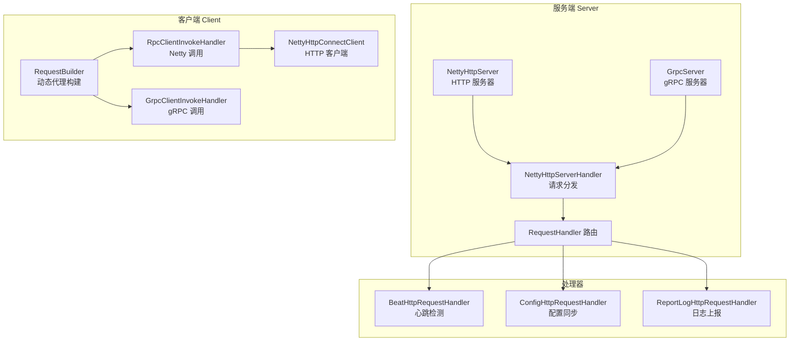
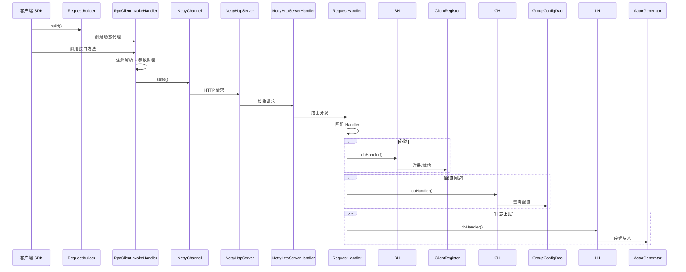

# RPC 通信层分析

> 本文档深入分析 silence-job-server 中的 RPC 通信层，涵盖 Netty HTTP、gRPC 双通道实现、请求处理器、以及客户端动态代理等核心组件。

## 目录

- [1. 整体架构概览](#1-整体架构概览)
- [2. Netty HTTP 服务端](#2-netty-http-服务端)
- [3. gRPC 服务端](#3-grpc-服务端)
- [4. Netty HTTP 客户端](#4-netty-http-客户端)
- [5. 请求处理器链路](#5-请求处理器链路)
- [6. 动态代理与重试机制](#6-动态代理与重试机制)
- [7. 协议设计](#7-协议设计)
- [8. 设计模式总结](#8-设计模式总结)

---

## 1. 整体架构概览

### 1.1 双通道架构



### 1.2 协议选择

| 特性 | Netty HTTP | gRPC |
|------|-----------|------|
| **协议** | HTTP/1.1 | HTTP/2 |
| **序列化** | JSON | Protocol Buffers |
| **多路复用** | 不支持 | 支持 |
| **流控** | 简单 | 复杂 |
| **配置项** | `SystemProperties.getRpcType()` | `RpcType.NETTY` / `RpcType.GRPC` |

### 1.3 核心组件关系



---

## 2. Netty HTTP 服务端

### 2.1 服务启动

**文件位置**：`silence-job-server-common/.../rpc/server/NettyHttpServer.java`

```java
@Component
@Order(Ordered.HIGHEST_PRECEDENCE)
public class NettyHttpServer implements Runnable, Lifecycle {

    @Override
    public void run() {
        if (started) return;  // 防止重复启动

        EventLoopGroup bossGroup = new NioEventLoopGroup();
        EventLoopGroup workerGroup = new NioEventLoopGroup();

        try {
            ServerBootstrap bootstrap = new ServerBootstrap();
            bootstrap.group(bossGroup, workerGroup)
                .channel(NioServerSocketChannel.class)
                .option(ChannelOption.SO_BACKLOG, 128)
                .childOption(ChannelOption.SO_KEEPALIVE, true)
                .childHandler(new ChannelInitializer<SocketChannel>() {
                    @Override
                    public void initChannel(SocketChannel channel) {
                        channel.pipeline()
                            .addLast(new HttpServerCodec())        // HTTP 编解码
                            .addLast(new HttpObjectAggregator(5 * 1024 * 1024))  // 5MB 聚合
                            .addLast(new NettyHttpServerHandler()); // 业务处理器
                    }
                });

            // 绑定端口，默认 17888
            ChannelFuture future = bootstrap.bind(systemProperties.getServerPort()).sync();
            started = true;
            future.channel().closeFuture().sync();
        } catch (Exception e) {
            started = false;
            throw new SilenceJobServerException("server start error");
        }
    }

    @Override
    public void start() {
        if (RpcType.NETTY != systemProperties.getRpcType()) {
            return;  // 非 Netty 类型不启动
        }
        thread = new Thread(this);
        thread.setDaemon(true);
        thread.start();
    }
}
```

### 2.2 关键配置

| 配置项 | 值 | 说明 |
|--------|-----|------|
| `SO_BACKLOG` | 128 | 连接队列长度 |
| `SO_KEEPALIVE` | true | TCP 保活 |
| `HttpObjectAggregator` | 5MB | 请求体最大长度 |
| 默认端口 | 17888 | 可配置 |

---

## 3. gRPC 服务端

### 3.1 服务启动

**文件位置**：`silence-job-server-common/.../rpc/server/GrpcServer.java`

```java
@Component
@Order(Ordered.HIGHEST_PRECEDENCE)
public class GrpcServer implements Lifecycle {

    @Override
    public void start() {
        if (started) return;

        if (RpcType.GRPC != systemProperties.getRpcType()) {
            return;
        }

        MutableHandlerRegistry handlerRegistry = new MutableHandlerRegistry();
        addServices(handlerRegistry, new GrpcInterceptor());

        NettyServerBuilder builder = NettyServerBuilder.forPort(systemProperties.getServerPort())
            .executor(createGrpcExecutor(grpc.getDispatcherTp()))
            .maxInboundMessageSize(grpc.getMaxInboundMessageSize())
            .keepAliveTime(keepAliveTime.toMillis(), TimeUnit.MILLISECONDS)
            .keepAliveTimeout(keepAliveTimeOut.toMillis(), TimeUnit.MILLISECONDS)
            .permitKeepAliveTime(permitKeepAliveTime.toMillis(), TimeUnit.MILLISECONDS);

        server = builder.fallbackHandlerRegistry(handlerRegistry).build();
        server.start();
        this.started = true;
    }
}
```

### 3.2 服务定义

```java
private void addServices(MutableHandlerRegistry handlerRegistry,
        ServerInterceptor... serverInterceptor) {

    // 创建 UNARY 类型服务定义
    ServerServiceDefinition serviceDefinition = createUnaryServiceDefinition(
        GrpcServerConstants.UNARY_SERVICE_NAME,
        GrpcServerConstants.UNARY_METHOD_NAME,
        new UnaryRequestHandler()
    );

    handlerRegistry.addService(serviceDefinition);
    handlerRegistry.addService(
        ServerInterceptors.intercept(serviceDefinition, serverInterceptor));
}

public static ServerServiceDefinition createUnaryServiceDefinition(
        String serviceName, String methodName,
        ServerCalls.UnaryMethod<GrpcSilenceJobRequest, GrpcResult> unaryMethod) {

    MethodDescriptor<GrpcSilenceJobRequest, GrpcResult> methodDescriptor =
        MethodDescriptor.<GrpcSilenceJobRequest, GrpcResult>newBuilder()
            .setType(MethodDescriptor.MethodType.UNARY)
            .setFullMethodName(MethodDescriptor.generateFullMethodName(serviceName, methodName))
            .setRequestMarshaller(ProtoUtils.marshaller(GrpcSilenceJobRequest.getDefaultInstance()))
            .setResponseMarshaller(ProtoUtils.marshaller(GrpcResult.getDefaultInstance()))
            .build();

    return ServerServiceDefinition.builder(serviceName)
        .addMethod(methodDescriptor, ServerCalls.asyncUnaryCall(unaryMethod))
        .build();
}
```

### 3.3 线程池配置

```java
private ThreadPoolExecutor createGrpcExecutor(ThreadPoolConfig threadPool) {
    ThreadPoolExecutor grpcExecutor = new ThreadPoolExecutor(
        threadPool.getCorePoolSize(),
        threadPool.getMaximumPoolSize(),
        threadPool.getKeepAliveTime(),
        TimeUnit.MILLISECONDS,
        new LinkedBlockingQueue<>(threadPool.getQueueCapacity()),
        new ThreadFactoryBuilder()
            .setDaemon(true)
            .setNameFormat("silence-job-grpc-server-executor-%d")
            .build()
    );
    grpcExecutor.allowCoreThreadTimeOut(true);
    return grpcExecutor;
}
```

---

## 4. Netty HTTP 客户端

### 4.1 Bootstrap 初始化

**文件位置**：`silence-job-server-common/.../rpc/client/NettyHttpConnectClient.java`

```java
@Component
@Order(Ordered.HIGHEST_PRECEDENCE)
public class NettyHttpConnectClient implements Lifecycle {

    private static final NioEventLoopGroup nioEventLoopGroup = new NioEventLoopGroup();
    private static final Bootstrap bootstrap = new Bootstrap();

    @Override
    public void start() {
        bootstrap.group(nioEventLoopGroup)
            .channel(NioSocketChannel.class)
            .handler(new ChannelInitializer<SocketChannel>() {
                @Override
                public void initChannel(SocketChannel channel) {
                    channel.pipeline()
                        .addLast(new IdleStateHandler(0, 0, 30, TimeUnit.SECONDS))  // 30s 空闲检测
                        .addLast(new HttpClientCodec())
                        .addLast(new HttpObjectAggregator(5 * 1024 * 1024))  // 5MB
                        .addLast(new NettyHttpClientHandler());
                }
            })
            .option(ChannelOption.SO_KEEPALIVE, true)
            .option(ChannelOption.CONNECT_TIMEOUT_MILLIS, 10000);  // 10s 连接超时

        NettyChannel.setBootstrap(bootstrap);
    }
}
```

### 4.2 客户端关键配置

| 配置项 | 值 | 说明 |
|--------|-----|------|
| `IdleStateHandler` | 30s | 空闲检测 |
| `CONNECT_TIMEOUT_MILLIS` | 10s | 连接超时 |
| `SO_KEEPALIVE` | true | TCP 保活 |

---

## 5. 请求处理器链路

### 5.1 请求分发器

```java
public class NettyHttpServerHandler extends ChannelInboundHandlerAdapter {

    @Override
    protected void channelRead0(ChannelHandlerContext ctx, FullHttpRequest request) {
        // 1. 解析路径
        String path = request.uri();

        // 2. 路由到对应 Handler
        HttpRequestHandler handler = requestHandlerMapping.get(path);
        if (handler == null) {
            handler = defaultHandler;
        }

        // 3. 执行处理
        SilenceJobRpcResult result = handler.doHandler(content, query, headers);

        // 4. 写入响应
        writeResponse(ctx, request, result);
    }
}
```

### 5.2 心跳处理器

**文件位置**：`silence-job-server-common/.../rpc/server/handler/BeatHttpRequestHandler.java`

```java
@Component
public class BeatHttpRequestHandler extends GetHttpRequestHandler {

    @Override
    public boolean supports(String path) {
        return HTTP_PATH.BEAT.equals(path);  // /api/beat
    }

    @Override
    public SilenceJobRpcResult doHandler(String content, UrlQuery query,
            HttpHeaders headers) {

        // 1. 构建注册上下文
        RegisterContext registerContext = new RegisterContext();
        registerContext.setGroupName(headers.get(HeadersEnum.GROUP_NAME.getKey()));
        registerContext.setHostPort(Integer.valueOf(headers.get(HeadersEnum.HOST_PORT.getKey())));
        registerContext.setHostIp(headers.get(HeadersEnum.HOST_IP.getKey()));
        registerContext.setHostId(headers.get(HeadersEnum.HOST_ID.getKey()));
        registerContext.setUri(HTTP_PATH.BEAT);

        // 2. 执行客户端注册/续约
        Register register = SilenceSpringContext.getBean(ClientRegister.BEAN_NAME, Register.class);
        boolean result = register.register(registerContext);

        // 3. 返回心跳响应
        return new SilenceJobRpcResult(PONG, retryRequest.getReqId());
    }
}
```

### 5.3 配置同步处理器

```java
@Component
public class ConfigHttpRequestHandler extends GetHttpRequestHandler {

    @Override
    public SilenceJobRpcResult doHandler(String content, UrlQuery urlQuery,
            HttpHeaders headers) {

        String groupName = headers.get(HeadersEnum.GROUP_NAME.getKey());
        String namespace = headers.get(HeadersEnum.NAMESPACE.getKey());

        // 查询组配置
        GroupConfig groupConfig = groupConfigDao.selectOne(
            new LambdaQueryWrapper<GroupConfig>()
                .eq(GroupConfig::getGroupName, groupName)
                .eq(GroupConfig::getNamespaceId, namespace)
        );

        ConfigDTO configDTO = convertToConfigDTO(groupConfig);
        return new SilenceJobRpcResult(JSON.toJSONString(configDTO), retryRequest.getReqId());
    }
}
```

### 5.4 日志上报处理器

```java
@Component
public class ReportLogHttpRequestHandler extends PostHttpRequestHandler {

    @Override
    public SilenceJobRpcResult doHandler(String content, UrlQuery urlQuery,
            HttpHeaders headers) {

        SilenceJobRequest retryRequest = JSON.parseObject(content, SilenceJobRequest.class);
        JSONArray jsonArray = JSON.parseArray(retryRequest.getArgs()[0].toString());

        List<RetryLogTaskDTO> retryTasks = new ArrayList<>();
        List<JobLogTaskDTO> jobTasks = new ArrayList<>();

        for (JSONObject node : jsonArray) {
            String logType = node.getString(SystemConstants.JSON_FILED_LOG_TYPE);

            if (LogTypeEnum.JOB.name().equals(logType)) {
                jobTasks.add(node.toJavaObject(JobLogTaskDTO.class));
            } else if (LogTypeEnum.RETRY.name().equals(logType)) {
                retryTasks.add(node.toJavaObject(RetryLogTaskDTO.class));
            }
        }

        // 异步写入 Actor
        if (CollectionUtils.isNotEmpty(jobTasks)) {
            ActorRef actorRef = ActorGenerator.jobLogActor();
            actorRef.tell(jobTasks, actorRef);
        }

        if (CollectionUtils.isNotEmpty(retryTasks)) {
            ActorRef actorRef = ActorGenerator.logActor();
            actorRef.tell(retryTasks, actorRef);
        }

        return new SilenceJobRpcResult(200, "success", Boolean.TRUE, retryRequest.getReqId());
    }
}
```

---

## 6. 动态代理与重试机制

### 6.1 RequestBuilder 构建器

**文件位置**：`silence-job-server-common/.../rpc/client/RequestBuilder.java`

```java
public class RequestBuilder<T, R> {

    public T build() {
        // 1. 根据 RPC 类型选择处理器
        SystemProperties properties = SilenceSpringContext.getBean(SystemProperties.class);
        RpcType rpcType = properties.getRpcType();

        InvocationHandler invocationHandler;
        if (rpcType == null) {
            // Netty HTTP
            invocationHandler = new RpcClientInvokeHandler(
                nodeInfo.getGroupName(), nodeInfo,
                failRetry, retryTimes, retryInterval, retryListener,
                routeKey, allocKey, failover, executorTimeout, namespaceId);
        } else {
            // gRPC
            invocationHandler = new GrpcClientInvokeHandler(...);
        }

        // 2. 创建动态代理
        return (T) Proxy.newProxyInstance(
            clintInterface.getClassLoader(),
            new Class[]{clintInterface},
            invocationHandler
        );
    }
}

// 使用示例
CommonRpcClient client = RequestBuilder.<CommonRpcClient, ApiResult>newBuilder()
    .nodeInfo(nodeInfo)
    .failRetry(true)
    .retryTimes(3)
    .routeKey(1)           // 负载均衡策略
    .allocKey(taskId)      // 路由 key
    .failover(true)        // 故障转移
    .client(CommonRpcClient.class)
    .build();
```

### 6.2 RPC 调用处理器

```java
public class RpcClientInvokeHandler implements InvocationHandler {

    @Override
    public ApiResult invoke(Object proxy, Method method, Object[] args) {
        Mapping annotation = method.getAnnotation(Mapping.class);

        if (failover) {
            return doFailoverHandler(method, args, annotation);
        }

        return requestRemote(method, args, annotation, 1);
    }

    private ApiResult doFailoverHandler(Method method, Object[] args, Mapping annotation) {
        Set<RegisterNodeInfo> serverNodeSet =
            CacheRegisterTable.getServerNodeSet(groupName, namespaceId);

        int size = serverNodeSet.size();
        for (int count = 1; count <= size; count++) {
            ApiResult result = requestRemote(method, args, annotation, count);
            if (result != null) {
                return result;
            }
        }
        throw new SilenceJobServerException("No available nodes.");
    }

    private ApiResult requestRemote(Method method, Object[] args, Mapping mapping, int count) {
        // 1. 构建重试器
        Retryer<ApiResult> retryer = buildResultRetryer();

        // 2. 执行请求
        return retryer.call(() -> {
            StopWatch sw = new StopWatch();
            sw.start();

            // 3. 发送请求
            SilenceJobFuture newFuture = SilenceJobFuture.newFuture(
                silenceJobRequest.getReqId(),
                executorTimeout.orElse(20),
                TimeUnit.SECONDS
            );
            RpcContext.setFuture(newFuture);

            NettyChannel.send(hostId, hostIp, hostPort,
                HttpMethod.valueOf(mapping.method().name()),
                mapping.path(),
                silenceJobRequest.toString(),
                requestHeaders
            );

            return (ApiResult) newFuture.get();
        });
    }

    private Retryer<ApiResult> buildResultRetryer() {
        return RetryerBuilder.<ApiResult>newBuilder()
            .retryIfException(throwable -> failRetry)
            .withStopStrategy(StopStrategies.stopAfterAttempt(retryTimes <= 0 ? 1 : retryTimes))
            .withWaitStrategy(WaitStrategies.fixedWait(retryInterval, TimeUnit.SECONDS))
            .withRetryListener(retryListener)
            .build();
    }
}
```

### 6.3 gRPC 调用处理器

```java
public class GrpcClientInvokeHandler implements InvocationHandler {

    @Override
    public ApiResult invoke(Object proxy, Method method, Object[] args) {
        Mapping annotation = method.getAnnotation(Mapping.class);

        if (failover) {
            return doFailoverHandler(method, args, annotation);
        }

        return requestRemote(method, args, annotation, 1);
    }

    private ApiResult requestRemote(Method method, Object[] args, Mapping mapping, int count) {
        // 1. 构建重试器
        Retryer<ApiResult> retryer = buildResultRetryer();

        return retryer.call(() -> {
            // 2. 发送 gRPC 请求
            ListenableFuture<GrpcResult> future = GrpcChannel.send(
                hostId, hostIp, hostPort,
                mapping.path(),
                JSON.toJSONString(args),
                requestHeaders,
                reqId
            );

            // 3. 等待响应
            GrpcResult grpcResult = future.get(
                Optional.ofNullable(executorTimeout).orElse(20),
                TimeUnit.SECONDS
            );

            Object obj = JSON.parseObject(grpcResult.getData(), Object.class);
            return new ApiResult<>(
                grpcResult.getStatus(),
                grpcResult.getMessage(),
                obj
            );
        });
    }

    // 故障转移：超时后剔除节点 + 重新路由
    @Override
    protected void onTimeoutOrError() {
        if (failover && ex.getCause() instanceof SilenceJobRemotingTimeOutException) {
            CacheRegisterTable.remove(groupName, hostId);
            ClientNodeAllocateHandler handler = ...
            RegisterNodeInfo serverNode = handler.getServerNode(
                allocKey, groupName, namespaceId, routeKey);

            this.hostId = serverNode.getHostId();
            this.hostPort = serverNode.getHostPort();
            this.hostIp = serverNode.getHostIp();
        }
    }
}
```

### 6.4 重试策略配置

| 参数 | 默认值 | 说明 |
|------|--------|------|
| `failRetry` | true | 是否失败重试 |
| `retryTimes` | 3 | 重试次数 |
| `retryInterval` | 1s | 重试间隔 |
| `executorTimeout` | 20s | 执行超时 |

---

## 7. 协议设计

### 7.1 请求格式

```java
public class SilenceJobRequest implements Serializable {
    private String reqId;       // 请求唯一 ID
    private Object[] args;      // 请求参数
    private Map<String, String> headers;  // 请求头
}
```

### 7.2 响应格式

```java
public class SilenceJobRpcResult implements Serializable {
    private int status;          // 状态码
    private String message;      // 消息
    private Object data;        // 数据
    private String reqId;       // 请求 ID（关联请求）
}
```

### 7.3 HTTP 路径

| 路径 | 用途 | Handler |
|------|------|---------|
| `/api/beat` | 心跳/注册 | `BeatHttpRequestHandler` |
| `/api/sync/config` | 配置同步 | `ConfigHttpRequestHandler` |
| `/api/batch/log/report` | 日志上报 | `ReportLogHttpRequestHandler` |

### 7.4 请求头设计

```java
public enum HeadersEnum {
    GROUP_NAME("X-Silence-Job-Group"),
    HOST_IP("X-Silence-Job-Host-IP"),
    HOST_PORT("X-Silence-Job-Host-Port"),
    HOST_ID("X-Silence-Job-Host-Id"),
    NAMESPACE("X-Silence-Job-Namespace");

    private final String key;

    HeadersEnum(String key) {
        this.key = key;
    }

    public String getKey() {
        return key;
    }
}
```

---

## 8. 设计模式总结

### 8.1 动态代理模式

```java
// RequestBuilder 创建代理
InvocationHandler handler = new RpcClientInvokeHandler(...);
return (T) Proxy.newProxyInstance(
    clintInterface.getClassLoader(),
    new Class[]{clintInterface},
    handler
);

// 客户端调用
CommonRpcClient client = RequestBuilder.<CommonRpcClient, ApiResult>newBuilder()
    .client(CommonRpcClient.class)
    .build();
client.executeJob(request);
```

### 8.2 策略模式

```java
// RPC 类型选择
if (rpcType == null) {
    handler = new RpcClientInvokeHandler(...);  // Netty HTTP
} else {
    handler = new GrpcClientInvokeHandler(...); // gRPC
}
```

### 8.3 责任链模式

```java
// 请求处理器路由
HttpRequestHandler handler = requestHandlerMapping.get(path);
if (handler == null) {
    handler = defaultHandler;
}
handler.doHandler(content, query, headers);
```

### 8.4 重试器模式

```java
// Guava Retryer
Retryer<ApiResult> retryer = RetryerBuilder.<ApiResult>newBuilder()
    .retryIfException(throwable -> failRetry)
    .withStopStrategy(StopStrategies.stopAfterAttempt(retryTimes))
    .withWaitStrategy(WaitStrategies.fixedWait(retryInterval, TimeUnit.SECONDS))
    .build();

return retryer.call(() -> {
    // 实际请求逻辑
});
```

### 8.5 Builder 模式

```java
// RequestBuilder
RequestBuilder.<CommonRpcClient, ApiResult>newBuilder()
    .nodeInfo(nodeInfo)
    .failRetry(true)
    .retryTimes(3)
    .failover(true)
    .build();
```

---

## 附录：关键配置参数

| 参数 | 默认值 | 说明 |
|------|--------|------|
| 默认端口 | 17888 | 服务端监听端口 |
| `CONNECT_TIMEOUT_MILLIS` | 10000ms | 客户端连接超时 |
| `IdleStateHandler` | 30s | 空闲检测时间 |
| `maxInboundMessageSize` | 5MB | 最大请求体 |
| `executorTimeout` | 20s | 执行超时时间 |
| `retryTimes` | 3 | RPC 重试次数 |
| `retryInterval` | 1s | 重试间隔 |
