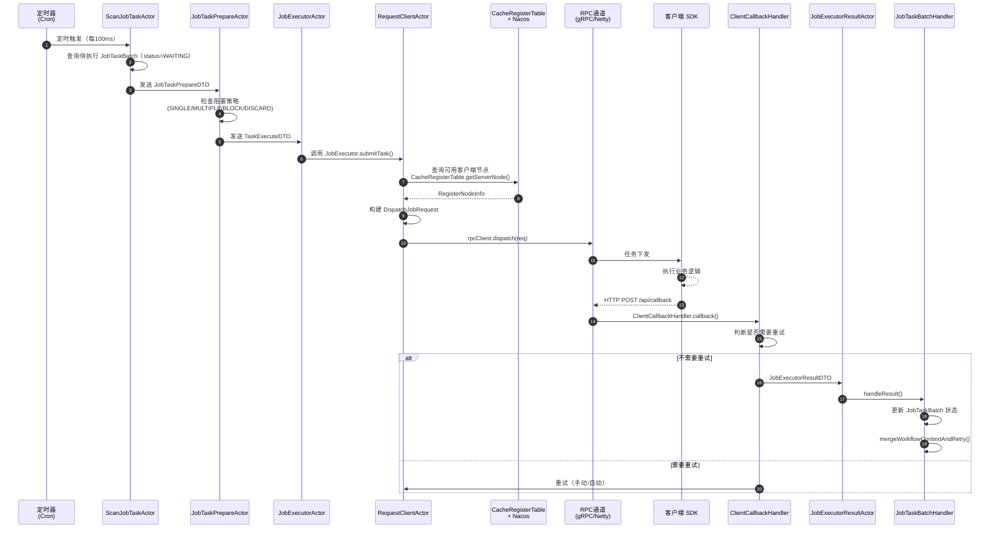
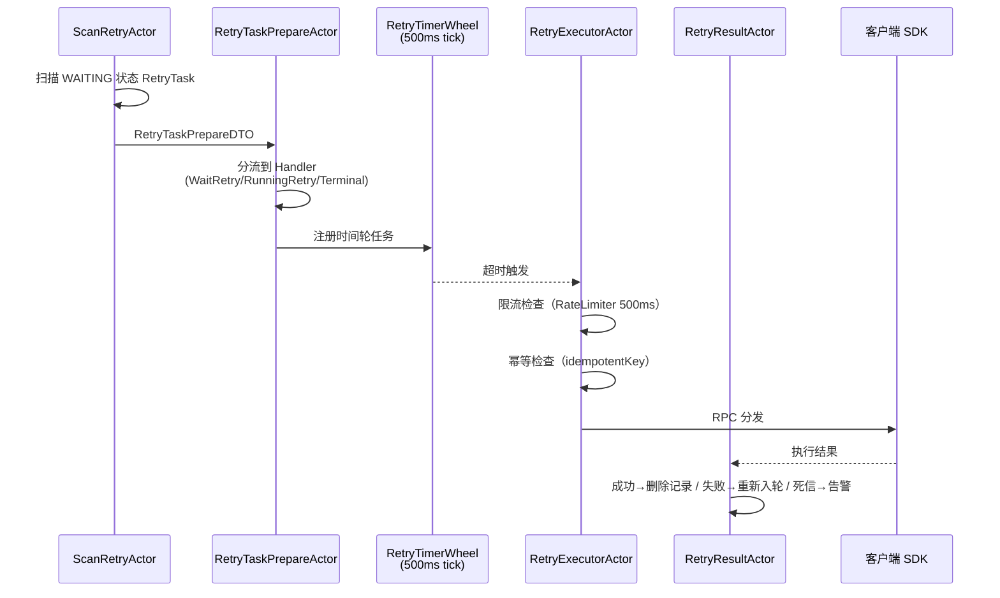

# 核心全链路流程详解

> 以一个 **Cron 定时 Job 任务** 从提交到完成的完整生命周期为线索，逐阶段解析各层组件的协作方式。

---

## 一、场景设定

**业务场景**：用户在管理端配置了一个每分钟执行一次的 Cron Job，绑定到 `group=payment` 的客户端节点。

**预期链路**：
```
[定时触发] → [扫描入库] → [节点分配] → [RPC分发] → [客户端执行] → [HTTP回调] → [状态更新] → [下次扫描]
```

---

## 二、整体序列图



---

## 三、逐阶段详细解析

### 阶段 1：定时扫描（DispatchService → ScanJobTaskActor）

**触发频率**：每 100ms（`dispatch.scan.interval`）

**触发链路**：
```
DispatchService（每100ms）
    ↓
ConsumerBucketActor（按 Bucket 分发）
    ↓
ScanJobTaskActor
```

**做了什么**：
1. `DispatchService` 定时执行，调用 `ConsumerBucketActor.tell(new ConsumerBucket(...))`
2. `ConsumerBucketActor` 将 Bucket 分发给 `ScanJobTaskActor`
3. `ScanJobTaskActor.doReceive()` 查询数据库中 `task_batch_status = WAITING` 且 `trigger_type = CRON` 的任务批次

**关键代码**：
```java
// ScanJobTaskActor.java
List<JobTaskBatch> jobTaskBatches = jobTaskBatchDao.selectList(
    new LambdaQueryWrapper<JobTaskBatch>()
        .eq(JobTaskBatch::getTaskBatchStatus, JobTaskBatchStatus.WAITING)
        .eq(JobTaskBatch::getTriggerType, TriggerType.CRON)
        .le(JobTaskBatch::getTriggerTime, LocalDateTime.now())
);
// 为每个批次发送 JobTaskPrepareDTO 到 PrepareActor
```

**涉及表**：`job_task_batch`

---

### 阶段 2：预处理（JobTaskPrepareActor — 阻塞策略）

**入口**：`JobTaskPrepareActor`

**核心逻辑**：检查当前任务的阻塞策略

| 策略 | 行为 |
|------|------|
| `SINGLE` | 同一 Job 只允许一个批次在执行 |
| `MULTIPLE` | 允许多个批次并行执行 |
| `BLOCK` | 等待前一批次完成再执行 |
| `DISCARD` | 直接丢弃重复批次 |

**关键代码**：
```java
// JobTaskPrepareActor.java
JobTaskBlockStrategy blockStrategy = job.getBlockStrategy();
if (JobTaskBlockStrategy.BLOCK.equals(blockStrategy)) {
    // 查询是否有执行中的批次
    List<JobTaskBatch> runningBatches = jobTaskBatchDao.selectList(
        new LambdaQueryWrapper<JobTaskBatch>()
            .eq(JobTaskBatch::getJobId, jobId)
            .in(JobTaskBatch::getTaskBatchStatus, JobTaskBatchStatus.RUNNING_LIST)
    );
    if (CollectionUtils.isNotEmpty(runningBatches)) {
        return; // 等待中，不下发
    }
}
```

**涉及 Actor**：通过 `ActorRef` 发送 `TaskExecuteDTO` 到 `JobExecutorActor`

---

### 阶段 3：执行分发（JobExecutorActor → RealJobExecutorActor）

**入口**：`JobExecutorActor`（extends `AbstractActor`）

**做了什么**：
1. 根据 `ClientInfo` 查找节点分配策略（`ClusterJobExecutor` / `MapReduceJobExecutor`）
2. 为每个 JobTask 生成对应的 `JobTaskBatch`
3. 将 `RealJobExecutorDTO` 发送到 `RequestClientActor`

**节点分配流程**（以 `ClusterJobExecutor` 为例）：
```java
// ClusterJobExecutor.java
RegisterNodeInfo clientNode = clientAllocateHandler.allocateClient(
    job.getNamespaceId(), job.getGroupName(), job.getClientAllocateStrategyEnum());
// 分配策略由 ClientLoadBalanceManager 决定（7种策略）
```

**负载均衡策略**（`ClientLoadBalanceManager`）：
- `CONSISTENT_HASH` — 一致性哈希（同任务永远路由到同一节点）
- `RANDOM` — 随机
- `ROUND` — 轮询
- `LRU` — 最近最少使用
- `FIRST` — 第一个可用
- `LAST` — 最后一个
- `WEIGHT` — 权重

**关键**：客户端 `clientId` 在此时被确定，写入 `JobTask.client_id` 字段

---

### 阶段 4：RPC 分发（RequestClientActor → 客户端）

**入口**：`RequestClientActor.doExecute()`

**做了什么**：
1. 从 `CacheRegisterTable` 查询节点信息
2. 通过 `buildRpcClient()` 构建带重试的 RPC 客户端
3. 调用 `rpcClient.dispatch(dispatchJobRequest)`

**双通道选择逻辑**：
```java
// RequestBuilder.java
RpcType rpcType = SystemProperties.getRpcType();
if (RpcType.GRPC.equals(rpcType)) {
    handler = new GrpcClientInvokeHandler(...);
} else {
    handler = new RpcClientInvokeHandler(...); // Netty HTTP
}
```

| 通道 | 协议 | 序列化 | 适用场景 |
|------|------|--------|---------|
| Netty HTTP | HTTP/1.1 | JSON | 控制面（心跳/配置/日志） |
| gRPC | HTTP/2 | Protobuf | 数据面（任务执行） |

**客户端接收**：`Client SDK` 收到 `DispatchJobRequest`，执行业务逻辑

**重试机制**（Guava Retryer）：
```java
RetryerBuilder<Boolean>()
    .retryIfException()
    .withStopStrategy(stopAfterAttempt(3))
    .withWaitStrategy(fixedWait(500, TimeUnit.MILLISECONDS))
    .build();
```

---

### 阶段 5：客户端回调（Client → ClientCallbackHandler）

**HTTP 端点**：`POST /api/callback`

**触发时机**：客户端执行完成后，主动调用

**处理链路**：
```
ClientCallbackHandler.callback()
    ↓
AbstractClientCallbackHandler.callback()
    ↓
是否需要重试？
    ├─ 是 → 更新 retry_count → 发回 RealJobExecutorActor
    └─ 否 → doCallback() → JobExecutorResultActor
```

**重试判断**：
```java
// AbstractClientCallbackHandler.java
boolean needRetry = isNeedRetry(context);  // retry_count < max_retry
if (needRetry && updateRetryCount(context)) {
    // 重试：手动立即重试 或 自动入时间轮
    if (MANUAL.equals(context.getRetryScene())) {
        actorRef.tell(realJobExecutorDTO, actorRef); // 立即执行
    } else {
        JobTimerWheel.registerWithJob(
            () -> new RetryJobTimerTask(realJobExecutorDTO),
            Duration.ofSeconds(job.getRetryInterval())); // 时间轮延迟
    }
    return;
}
```

**幂等控制**：通过 Caffeine/Guava Cache 缓存 `idempotentKey`（20s 过期），防止重复处理

---

### 阶段 6：结果处理（JobExecutorResultActor → JobTaskBatchHandler）

**入口**：`JobExecutorResultActor`

**做了什么**：
1. 更新 `JobTask` 和 `JobTaskBatch` 的执行状态（SUCCESS / FAIL）
2. 调用 `JobTaskBatchHandler.handleResult()`
3. 处理 Workflow 场景：触发下游节点

**状态更新**：
```java
// JobExecutorResultActor.onReceive()
JobTaskBatch jobTaskBatch = jobTaskBatchDao.selectById(result.getTaskBatchId());
jobTaskBatch.setTaskBatchStatus(JobTaskBatchStatus.SUCCESS); // 或 FAIL
jobTaskBatch.setCompleteTime(LocalDateTime.now());
jobTaskBatchDao.updateById(jobTaskBatch);

// 触发 Workflow 下游节点
jobTaskBatchHandler.handleResult(result);
```

**涉及表**：`job_task_batch`、`job_task`

---

### 阶段 7：Workflow 下游节点触发（WorkflowExecutorActor）

**触发时机**：Job 节点执行完成后，如果是 Workflow 的一部分

**判断逻辑**（`WorkflowExecutorActor.doExecutor()`）：
```java
// 检查所有前置节点是否已完成
Set<BigInteger> predecessors = graph.predecessors(workflowNode.getId());
boolean predecessorsComplete = arePredecessorsComplete(...);

for (WorkflowNode workflowNode : workflowNodes) {
    if (!predecessorsComplete) {
        continue;  // 前置节点未完成，跳过
    }
    // 执行当前节点
    WorkflowExecutor workflowExecutor =
        WorkflowExecutorFactory.getWorkflowExecutor(workflowNode.getNodeType());
    workflowExecutor.execute(context);
}
```

**DAG 完成判断**：
```java
// 所有叶子节点（end nodes）都完成后，工作流结束
Set<BigInteger> leaves = MutableGraphCache.getLeaves(graph, workflowTaskBatchId);
boolean allComplete = leaves.stream().allMatch(nodeId -> ...);
```

---

## 四、独立 Retry 子系统的完整链路

Retry 子系统是**独立于 Job/Workflow** 的另一条 Actor 链路：



**关键参数**：
- 时间轮：500ms tick，512 槽，16 线程
- 限流：`RateLimiter.tryAcquire(500ms)`，超过则跳过本轮
- 幂等：`idempotentKey` 缓存 20s

---

## 五、关键表操作汇总

| 阶段 | 读表 | 写表 |
|------|------|------|
| 扫描 | `job_task_batch` (status=WAITING) | — |
| 预处理 | `job_task` (block check) | — |
| 节点分配 | `client_register` | — |
| 执行分发 | — | `job_task.client_id` |
| 客户端执行 | — | — |
| 回调 | — | `job_task.status`, `job_task.wf_context` |
| 结果处理 | `job_task_batch` | `job_task_batch.status` |
| Workflow 触发 | `workflow_node`, `job_task_batch` | `workflow_task_batch.wf_context` |
| Retry | `retry_task` | `retry_task.status` |
| 重试结果 | — | `retry_dead_letter` (死信) |

---

## 六、数据流向总览

```
┌─────────────────────────────────────────────────────────────┐
│                     管理端（用户操作）                        │
│         创建 Job → 配置 Cron → 绑定 Group → 提交             │
└────────────────────────┬────────────────────────────────────┘
                         │ INSERT job_task_batch (WAITING)
                         ▼
┌─────────────────────────────────────────────────────────────┐
│               调度层（每 100ms 扫描）                        │
│    ScanJobTaskActor → JobTaskPrepareActor → JobExecutorActor│
└────────────────────────┬────────────────────────────────────┘
                         │ 查询 client_register
                         ▼
┌─────────────────────────────────────────────────────────────┐
│              节点分配（7 种负载均衡策略）                      │
│         ClusterJobExecutor → CacheRegisterTable             │
└────────────────────────┬────────────────────────────────────┘
                         │ RPC dispatch (gRPC/Netty)
                         ▼
┌─────────────────────────────────────────────────────────────┐
│                    客户端 SDK 执行                           │
│              执行业务逻辑 → HTTP POST /api/callback          │
└────────────────────────┬────────────────────────────────────┘
                         │ 更新 job_task.status
                         ▼
┌─────────────────────────────────────────────────────────────┐
│                  结果处理层                                  │
│  ClientCallbackHandler → JobExecutorResultActor → BatchHandler│
│                                                                 │
│  Workflow 场景：                                               │
│  mergeWorkflowContext() → WorkflowExecutorActor → 触发下游节点 │
│                                                                 │
│  Retry 场景：                                                  │
│  RetryTimerWheel → RetryExecutorActor → 重新 RPC 分发          │
└────────────────────────┬────────────────────────────────────┘
                         │
                         ▼
              ┌────────────────────┐
              │   告警通知链        │  (可选)
              │  AlarmNotifyChain  │
              └────────────────────┘
```

---

> 📌 详细代码分析请参考各子系统分析文档：
> - `doc/02-execution-chain-analysis.md` — 任务执行链路
> - `doc/05-retry-subsystem-analysis.md` — 重试子系统
> - `doc/06-distributed-infrastructure-analysis.md` — 注册发现与锁
> - `doc/07-rpc-communication-analysis.md` — RPC 通信层
